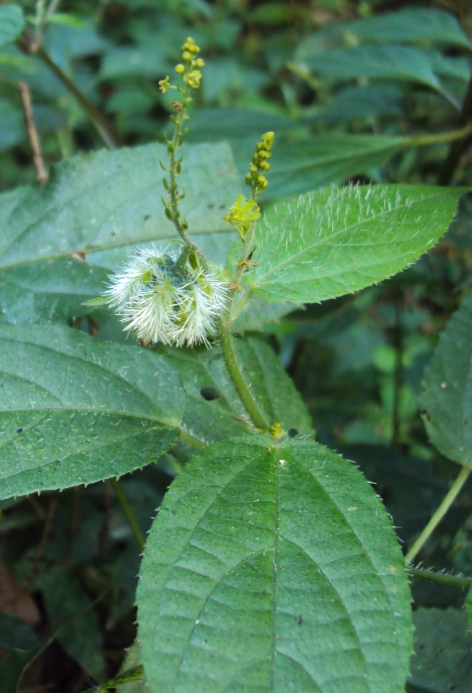

# Tragia involucrata - Duhsparsha

[TOC]

**Tragia involucrata** is a perennial twinning herb, covered with stinging hairs. Flowers are borne in racemes in leaf axils. Female flowers are few in lower part of inflorescence and male flowers are many in the upper part. Fruit is a 3-lobed capsule, containing 3 round smooth seeds. This herb is belongs to Euphorbeaceae family.
## Uses
Fever, Itching, Bronchits, Skin Diseases, Baldness.

## Parts Used
Leaves, Roots.

## Chemical Composition
Seeds yield a fixed oil containing about 62% linoleic acid and enzymes. They are also rich in proteins (Ghani, 2003).

## Common names
| Language | Names |
| --- | --- |
| Kannada | Turike Balli |
| Malayalam | Kodithoova, Cherukodithuva |
| Sanskrit | Vrischikali |
| Tamil | Kanchori |
| Telugu | Telukondicettu |
| Hindi | Barhanta |
| English | stinging nettle |
.

## Properties
Reference: Dravya - Substance, Rasa - Taste, Guna - Qualities, Veerya - Potency, Vipaka - Post-digesion effect, Karma - Pharmacological activity, Prabhava - Therepeutics.
### Dravya
### Rasa
### Guna
### Veerya
### Vipaka
### Karma
### Prabhava
## Habit
Annual herb

## Identification
### Leaf
Simple, Alternate, Leaves 6-10 x 3-5.5 cm, ovate or elliptic, base acute or rounded, margin serrate, apex acuminate, hispidulous on both sides

### Flower
Unisexual, Axillary spikes, Greenish yellow, 3, 2 cm long; male flowers above, female flowers 1-2, at the base. Male flowers c. 1.5 mm across

### Fruit
Capsule, 0.6 x 1cm, 3-lobed, hispid, Seeds globose

### Other features
## List of Ayurvedic medicine in which the herb is used
## Where to get the saplings
## Mode of Propagation
Seeds.

## How to plant/cultivate

## Commonly seen growing in areas
Tall grasslands, Borders of forests and fields.

## Photo Gallery
_(3977248218).jpg)
_(6225257497).jpg)
_(5089184494).jpg)
.jpg)
_(3977242156).jpg)
_(5360458796).jpg)
_(6225771616).jpg)
_(3977240600).jpg)

## References

## External Links
* [Journal for African medicinal plants](https://www.ncbi.nlm.nih.gov/pmc/articles/PMC5412214/)
* [Some Pharmacognostical Characteristics of Tragia Involucrata Linn. Roots](https://www.ncbi.nlm.nih.gov/pmc/articles/PMC3336427/)
* [Tragia involucrata on asia-medicinalplants](http://www.asia-medicinalplants.info/tragia-involucrata-l/)
* [Tragia involucrata on keralaayurvedics](http://www.keralaayurvedics.com/herbs-plants/choriyanam-tragia-involucrata-ayurvedic-medicinal-herbs.html)

## References

1. [Constituents](Chemical)(http://www.mpbd.info/plants/tragia-involucrata.php)
2. [Morphology](https://indiabiodiversity.org/species/show/231373)
3. [Cultivation]
4. Karnataka Aushadhiya Sasyagalu By Dr.Maagadi R Gurudeva, Page no:63
