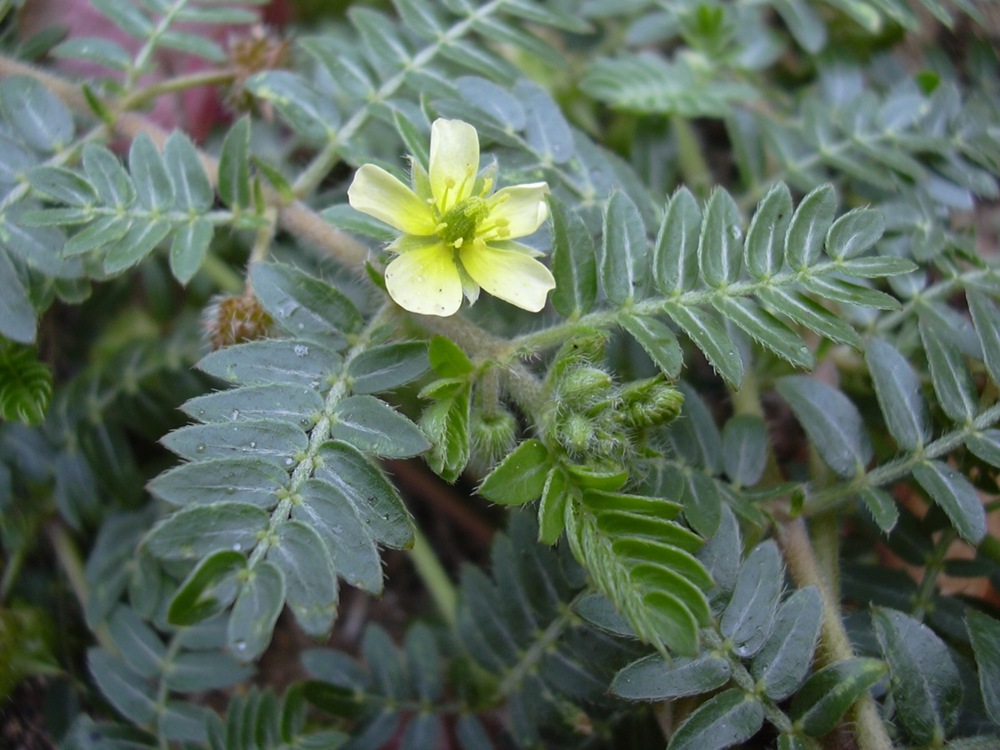

# Tribulus terrestris - Gokshura

[TOC]

**Tribulus terrestris** is an annual plant in the caltrop family. It is widely distributed around the world, that is adapted to grow in dry climate locations in which few other plants can survive.
## Uses
Impotency, Painful urination, Kidney diseases, Gout diseases, Cancer, Blotches, Pimples, Leprosy, Skin diseases, Psoriasis, Congestion.

### Food
Tribulus terrestris can be used in Food. Young leaves and tender fruits are cooked as vegetable.

## Parts Used
Fruits, Leaves.

## Chemical Composition
Sterols such as beta-sitosterols or stigma. These chemical compounds help to protect the prostate gland from swelling and in combination with the X steroidal saponins, may help to protect the prostate from cancer.

## Common names
| Language | Names |
| --- | --- |
| Kannada | ನೆಗ್ಗಿಲು Neggilu, ನೆರಿಗಿಲು Nerigilu |
| Malayalam | Nerinnii |
| Sanskrit | Ashvadanshtra |
| Tamil | Palleru-mullu |
| Telugu | Cinnpalleru |
| Hindi | Gokharu |
| English | Puncture Vine, Caltrop |

## Properties
Reference: Dravya - Substance, Rasa - Taste, Guna - Qualities, Veerya - Potency, Vipaka - Post-digesion effect, Karma - Pharmacological activity, Prabhava - Therepeutics.
### Dravya
### Rasa
Tikta (Bitter), Kashaya (Astringent)
### Guna
Laghu (Light), Ruksha (Dry), Tikshna (Sharp)
### Veerya
Ushna (Hot)
### Vipaka
Katu (Pungent)
### Karma
Kapha, Vata
### Prabhava
### Nutritional components
Tribulus terrestris Contains the Following nutritional components like - Vitamin-A, B and C; Alkaloides; Tannins; Phenols; Flavonoides; Flavonal glycosides; Steroidal saponins; Calcium, Copper, Iron, Magnesium, Manganese, Phosphorus, Potassium, Sulphur, Zinc

## Habit
Herb

## Identification
### Leaf
Simple, Pinnate, The leaves are pinnately compound with leaflets less than a quarter-inch long

### Flower
Unisexual, 4-10 mm wide, Yellow, 5-20, The flowers are 4-10 mm wide, with five lemon-yellow petals. A week after each flower blooms

### Fruit
10 mm longe, Fruit is easily falls apart into four or five single-seeded nutlets, 5, Fruiting season is April to August

### Other features
## List of Ayurvedic medicine in which the herb is used
* [Gokshuradi churna](Gokshuradi_churna.md)
* [Gokshuradi guggulu](Gokshuradi_guggulu.md)
* [Dashamoolarishta](../medicines/Dashamoolarishta.md)

## Where to get the saplings
## Mode of Propagation
Seeds, Cuttings.

## How to plant/cultivate
We have very little information on this species and are not sure how successful it will be in Britain. Tribulus terrestris is available throughout the year.

## Commonly seen growing in areas
Tall grasslands, Weed in Europe, Sandy seashores in Japan.

## Photo Gallery
_on_Devil's_Thorn_flower_(Tribulus_terrestris)_(11884336176).jpg)
.jpg)

.jpg)
_(11883835994).jpg)

## References

## External Links
* [Identification of fruits of Tribulus terrestris Linn. and Pedalium murex Linn-A pharmacognostical approach](https://www.ncbi.nlm.nih.gov/pmc/articles/PMC3361934/)
* [Tribulus terrestris on science direct.com](https://www.sciencedirect.com/science/article/abs/pii/S0031942213001453)
* [Tribulus terrestris on Richters.com](https://www.richters.com/show.cgi?page=QandA/Commercial/20020522-2.html)

## References

1. [constituents](Chemical)(https://www.mdidea.com/products/herbextract/tribulus/data05.html)
2. Kappatagudda - A Repertoire of  Medicianal Plants of Gadag by Yashpal Kshirasagar and Sonal Vrishni, Page No. 374
3. [names](Common)(https://sites.google.com/site/indiannamesofplants/via-species/t/tribulus-terrestris)
4. [details](Cultivation)(https://pfaf.org/user/Plant.aspx?LatinName=Tribulus+terrestrisia)
5. [preparations](Ayurvedic)(https://easyayurveda.com/2012/10/19/tribulus-benefits-dosage-side-effects-medicines-ayurvedic-details/)
6. "Forest food for Northern region of Western Ghats" by Dr. Mandar N. Datar and Dr. Anuradha S. Upadhye, Page No.148, Published by Maharashtra Association for the Cultivation of Science (MACS) Agharkar Research Institute, Gopal Ganesh Agarkar Road, Pune
