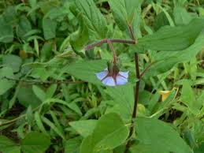

# Trichodesma indicum - Adhapuspi, Indian Borage

[TOC]

**Adhakpuspi** is an Indian medicinal plant found in the Indian subcontinent. These are widely distributed as a weed throughout India. They grow to an altitude of about 1500 m in the Himalayas and it is used as a fertiliser and as an herbal medicine.
## Uses
Arthritis, Anorexia, Dysentery, Skin dise, Snake bite, Dairrhea, Dysmenorrhea, Abortion case.

## Parts Used
Whole plant, Roots.

## Chemical Composition
The seed of the plant contains lenoleic acid, Oleic acid, palmatic acid.The leaves cotains hexaconase, Ethylhexacosanoate, Ethylester and 21, 24 Hexacosadeinoic acid.

## Common names
| Language | Names |
| --- | --- |
| Kannada | Athomukhi, Kattetumbesoppu |
| Malayalam | Kilukkamtumpa |
| Sanskrit | Adhapushpi |
| Tamil | Kulittaitumpai, Kallutaitumpai |
| Telugu | Guvagatti |
| Hindi | Anadhahuli, Chotakulpha |
| English | Indian Borage |

## Habit
Herb.

## Identification
### Leaf
Simple, Oblong-lanceolate, Leaf Apex is Acite and its base is Acute-auriculate.it has entire leaf margin.

### Flower
Unisexual, 4-8cm long, Blue, Flowering from September-November and January-March.

### Fruit
Smooth, Smooth on the outer and rugosely pitted on the inner face., In almost free, 4 nutlets, Fruiting throughout the year.

### Other features
## List of Ayurvedic medicine in which the herb is used
## Where to get the saplings
## Mode of Propagation
Seeds.

## How to plant/cultivate
The plant is found as a weed in many areas of the tropics and subtropics.

## Commonly seen growing in areas
Himalayas, Cultivated fields, Dry stony wastelands, Black cotton soil.

## Photo Gallery

## References

## External Links
* [Indian Borage on easyayurveda.com](https://easyayurveda.com/2017/02/01/trichodesma-indicum/)
* [Indian Borage on bimbima.com](https://www.bimbima.com/ayurveda/medicinal-plant-indian-borage-trichodesma-indicum/210/)
* [Indian Borage on eflora of gandhinagar.in](http://www.efloraofgandhinagar.in/herb/trichodesma-indicum)
* [Indian Borage on ijbtt journal.org](http://www.ijbttjournal.org/volume-5/issue-1/IJBTT-V5P601.pdf)

## References

1. [ayurveda](Easy)(https://easyayurveda.com/2017/02/01/trichodesma-indicum/)
2. [Morphology](https://indiabiodiversity.org/species/show/33327)
3. [plants](Trophical)(http://tropical.theferns.info/viewtropical.php?id=Trichodesma+indicum)
4. ”Karnataka Medicinal Plants Volume - 2” by Dr.M. R. Gurudeva, Page No.49, Published by Divyachandra Prakashana, #45, Paapannana Tota, 1st Main road, Basaveshwara Nagara, Bengaluru.
