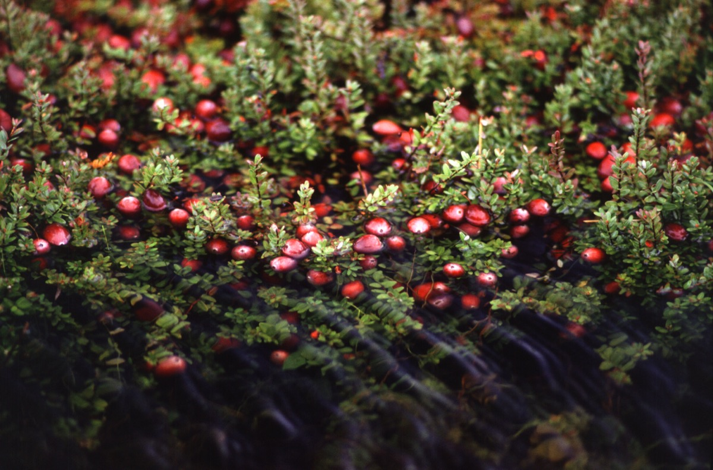

# Vaccinium - Karamarda

[TOC]

**Cranberries** are a group of evergreen dwarf shrubs or trailing vines in the subgenus Oxycoccus of the genus Vaccinium.
## Uses
Lower blood pressure, Diabetes, Hemorrhoids, Varicose veins, Angina, Cancer, Kidney stones, Diarrhea, Blood pressure

## Parts Used
Fruits, Leaves.

## Chemical Composition
It contains chrysoeriol, scopoletin, trans-p-hydroxycinnamic acid, trans-p-hydroxycinnamic acid ethyl ester, cafeic acid ethyl ester, beta-sitosterol, iuteolin, quercetin, esculetin , cafeic acid, isolariciresinol-9-O-beta-D-xyloside, 10-O-trans-p-coumaroylsandoside

## Common names
| Language | Names |
| --- | --- |
| Kannada | Anduvan |
| Malayalam | Kelamaram |
| Tamil | Anduvan |
| English | Indian Cranberry |

## Properties
Reference: Dravya - Substance, Rasa - Taste, Guna - Qualities, Veerya - Potency, Vipaka - Post-digesion effect, Karma - Pharmacological activity, Prabhava - Therepeutics.
### Dravya
### Rasa
Tikta (Bitter), Kashaya (Astringent)
### Guna
Laghu (Light), Ruksha (Dry), Tikshna (Sharp)
### Veerya
Ushna (Hot)
### Vipaka
Katu (Pungent)
### Karma
Kapha, Vata
### Prabhava
## Habit
Deciduous Shrub

## Identification
### Leaf
Simple, The leaves are ovate, in an irregular oval or slightly egg shape that is wider at the bottom than the top

### Flower
Unisexual, 0.33" long, White to very light pink, 5-20, Blooms are typically numerous and somewhat showy and Bloom time is May

### Fruit
Blue-black berry, 0.25" to 0.5" diameter, Eaten readily by wildlife and humans, Ripen July through August, 1

### Other features
## List of Ayurvedic medicine in which the herb is used
## Where to get the saplings
## Mode of Propagation
Seeds.

## How to plant/cultivate
Landscape Uses: Border, Massing, Seashore. Requires a moist but freely-draining lime free soil, preferring one that is rich in peat or a light loamy soil with added leaf-mould

## Commonly seen growing in areas
Swamps, Low wet woods, Pine barrens, Dry uplands.

## Photo Gallery
.jpg)

## References

## External Links
* [Vaccinium on science direct](https://www.sciencedirect.com/topics/agricultural-and-biological-sciences/vaccinium-myrtillus)
* [Vaccinium on online library.wiley.com ](https://onlinelibrary.wiley.com/doi/abs/10.1111/jfbc.12414)
* [How to Grow Vaccinium Myrtillus](http://homeguides.sfgate.com/grow-vaccinium-myrtillus-47553.html)
* [The European blueberry (Vaccinium myrtillus L.) and the potential for cultivation](https://www.researchgate.net/publication/220005144_The_European_blueberry_Vaccinium_myrtillus_L_and_the_potential_for_cultivation_A_review)

## References

1. [constituents](Chemical)(https://www.ncbi.nlm.nih.gov/pubmed/19160790)
2. [morphology](Plant)(http://hort.uconn.edu/detail.php?pid=517)
3. [details](Cultivation)(https://www.pfaf.org/user/Plant.aspx?LatinName=Vaccinium+corymbosum)
