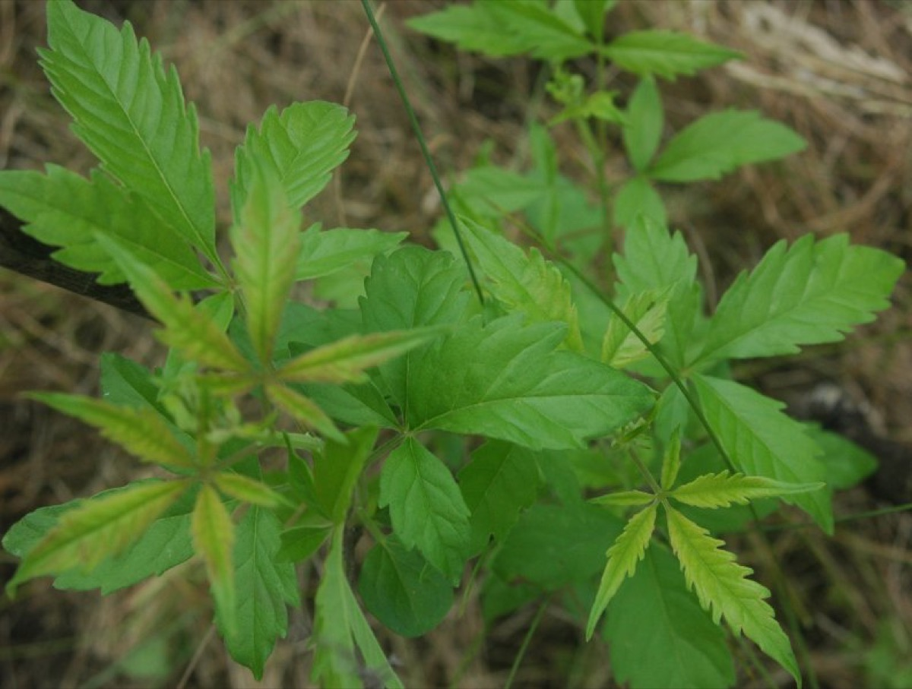

# Vitex negundo

[TOC]

**Vitex negundo** is a much branched shrub. It grows up to 8 metres tall.
It is a multipurpose shrub, it is used for traditional medicine, yields an edible seed and provides various other commodities. It is cultivated as a hedge and medicinal plant, and is also sometimes grown as an ornamental. This plant is belongs to Verbenaceae family.
## Uses
Cough, Diarrhoea, Backache, Joint pain, Stops gum bleeding, Toothache, Arthritis, Joint pain.

## Parts Used
Root, Leaves, Seeds.

## Chemical Composition
Volatile oil of Vitex negundo is reported to contain β-carryophyllene, sabinene, linalool, terpinen-4-ol, α-guaiene and globulol as major constituents along with sesquiterpenes, monoterpenes, terpenoids and sterols.

## Common names
| Language | Names |
| --- | --- |
| Sanskrit | Indrani, Nirgundi |
| English | Five-leaved chaste tree, Indian privet |
| Gujarati | Nagod |
| Hindi | Indrani, Nirgunthi |
| Kannada | ಇನ್ದ್ರಾಣಿ Indrani, ಕರಿ ಲಕ್ಕಿ Kari lakki, ಲಕ್ಕಿ ಗಿಡ Lakki gida |
| Malayalam | Karinocchi, Nocchi |
| Marathi | Indrani, Niguda |
| Punjabi | Marwande |
| Tamil | Karu-nocci, Nocci |
| Telugu | Nirgundi, Sambali |

## Properties
Reference: Dravya - Substance, Rasa - Taste, Guna - Qualities, Veerya - Potency, Vipaka - Post-digesion effect, Karma - Pharmacological activity, Prabhava - Therepeutics.
### Dravya
### Rasa
### Guna
### Veerya
### Vipaka
### Karma
### Prabhava
## Habit
Deciduous Shrub

## Identification
### Leaf

### Flower
### Fruit
### Other features
## List of Ayurvedic medicine in which the herb is used
## Where to get the saplings
## Mode of Propagation
Cuttings of half-ripe wood, Seeds.

## How to plant/cultivate
Vitex negundo can be grown in warm temperate to tropical areas, succeeding at elevations from sea level to around 2,000 metres. It is found in areas where the mean annual rainfall is in the range of 600 - 2,000mm.  It can tolerate short-lived temperatures falling down to about -10°c.

## Commonly seen growing in areas
Mixed thickets.

## Photo Gallery

.jpg)

## References

## External Links
* [Vitex negundo on the ferns.info](http://tropical.theferns.info/viewtropical.php?id=Vitex+negundo)

## References

1. [constituents](Chemical)(https://ijpsr.com/bft-article/phytochemical-and-biological-evaluation-of-vitex-negundo-linn-a-review/?view=fulltext#:~:text=Volatile%20oil%20of%20Vitex%20negundo,%2C%20monoterpenes%2C%20terpenoids%20and%20sterols.)
2. [names](Common)(https://sites.google.com/site/indiannamesofplants/via-species/v/vitex-negundo)
3. [Morphology]
4. [Cultivation]
5. Indian Medicinal Plants by C.P.Khare
6. Karnataka Aushadhiya Sasyagalu By Dr.Maagadi R Gurudeva, Page no:303
