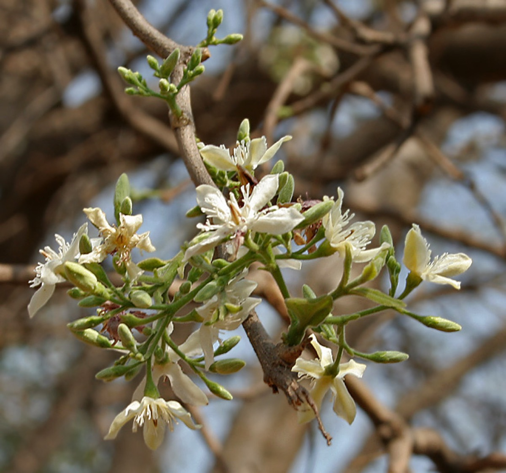

# Wrightia tinctoria - Svetakutaja

[TOC]

**Wrightia tinctoria** is a flowering plant species in the genus Wrightia found in India, southest Asia and Australia. It is found in dry and moist regions in its distribution. Various parts of the plant have medicinal properties.

## Uses
Psoriasis, Cancer, Wound, Obesity, Diabetes, Pain, Pimples, Diarrhea, Sore throats

### Food
Svetakutaja can be used in Food. Leaves and fruits are cooked as vegetable.

## Parts Used
Leaves, Flowers.

## Chemical Composition
Cycloartenone, Cycloeucalenol, Beta-Amyrin, Beta Sitosterol

## Common names
| Language | Names |
| --- | --- |
| Kannada | Kodamurki |
| Malayalam | Aiyappala, Kampippaala |
| Sanskrit | Stri Kutaja |
| Tamil | Veppalai |
| Telugu | Amkuda |
| Hindi | Dudhi, Karayaja |
| English | Pala Indigo, Sweet indrajao |

## Properties
Reference: Dravya - Substance, Rasa - Taste, Guna - Qualities, Veerya - Potency, Vipaka - Post-digesion effect, Karma - Pharmacological activity, Prabhava - Therepeutics.
### Dravya
### Rasa
Tikta (Bitter), Kashaya (Astringent)
### Guna
Laghu (Light), Ruksha (Dry), Tikshna (Sharp)
### Veerya
Ushna (Hot)
### Vipaka
Katu (Pungent)
### Karma
Kapha, Vata
### Prabhava
### Nutritional components
Svetakutaja Contains the Following nutritional components like - Vitamin-A, B and C; Indigotin, Inderutain, Isatin, Lupeol, Rutin, Tryptanthrin, Urosolic acid, Wrightial; Calcium, Copper, Iron, Magnesium, Manganese, Phosphorus, Potassium, Sodium, Sulphur, Zinc

## Habit
Deciduous tree

## Identification
### Leaf
Simple, Opposite, Leaves are distichous, estipulate; petiole 2-5 mm long, stout, glabrous

### Flower
Bisexual, 1.5 mm long, White, 5, Flowers Season is June - August and scented, in terminal cymes appearing along with new leaves

### Fruit
15-45 cm long, Clearly grooved lengthwise, Lowest hooked hairs aligned towards crown, With hooked hairs

### Other features
## List of Ayurvedic medicine in which the herb is used
* [Kutajavaleha](../medicines/Kutajavaleha.md)
* [Brihat Gangadhara churna](Brihat_Gangadhara_churna.md)
* [Mahamanjishtadhi kashaya](Mahamanjishtadhi_kashaya.md)
* [Stanyashodhana kashaya](Stanyashodhana_kashaya.md)
* [Patoladi churnam](Patoladi_churnam.md)

## Where to get the saplings
## Mode of Propagation
Seeds, Cuttings.

## How to plant/cultivate
Wrightia tinctoria is a plant of arid, semi-arid and moist regions in the tropics, where it can be found at elevations up to 1,200 metres. It is found in areas where the mean annual rainfall is within the range 400 - 2,500mm, and the mean temperature range 17 - 25°c. Svetakutaja is available through

## Commonly seen growing in areas
Dry soil region, Deciduous forests.

## Photo Gallery

## References

## External Links
* [Wrightia tinctoria on psoriasisselfmanagement.com](http://www.psoriasisselfmanagement.com/natural-herbs-supplements/wrightia-tinctoria-for-psoriasis/)
* [Wrightia tinctoria on wrightia-tinctoria.com](https://mavcure.com/wrightia-tinctoria/)
* [A review on phytochemical, pharmacological, and pharmacognostical profile of Wrightia tinctoria: Adulterant of kurchi](https://www.ncbi.nlm.nih.gov/pmc/articles/PMC3931199/)

## References

1. [contituents](Chemical)(https://mavcure.com/wrightia-tinctoria/)
2. [description](Plant)(https://indiabiodiversity.org/species/show/31903)
3. [preparations](Ayurvedic)(https://easyayurveda.com/2013/10/17/kutaja-benefits-usage-dose-side-effects-ayurveda-details/)
4. [Details](Cultivation)(http://tropical.theferns.info/viewtropical.php?id=Wrightia+tinctoria)
5. "Forest food for Northern region of Western Ghats" by Dr. Mandar N. Datar and Dr. Anuradha S. Upadhye, Page No.152, Published by Maharashtra Association for the Cultivation of Science (MACS) Agharkar Research Institute, Gopal Ganesh Agarkar Road, Pune
