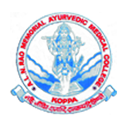

# A.L.N. Rao Memorial Ayurvedic Medical College

* A.L.N. Rao Memorial Ayurvedic Medical College**

| | |
| --- | --- |
| Type | Private |
| Established | 1987 |
| Location | Kachkal Road, Koppa, Chikmagalur, Karnataka |
| Affiliations | University of Delhi |
| Website | http://alnrmamc.com |

**Course offered**

* **BAMS – Bachelor of Ayurvedic Medicine and Surgery**

* **Post Graduation Courses**
  * DRAVYAGUNA  (Pharmacognosy)  -  6 Seats
  * BHAISHAJYA KALPANA (Pharmacy)  -  5 Seats
  * KAYA CHIKTISA (General Medicine) –  5 Seats
