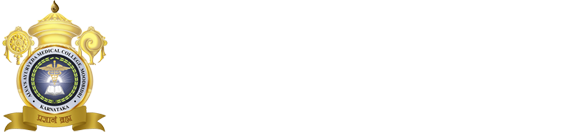

# Alva's Ayurvedic Medical College

* Alva's Ayurvedic Medical College**

| | |
| --- | --- |
| Type | Private |
| Established | 1996 |
| Location | Near New Bustand, Moodbidri , Dakshina Kannada 574227, Karnataka. |
| Affiliations | Rajeev Gandhi University of Health Sciences |
| Website | http://www.alvasayurveda.com/ |

**Courses Offered**

* B.A.M.S

* B.N.Y.S

* M.D (Ayu) Panchakarma
* M.D (Ayu) Shalya
* M.D (Ayu) Kaumara
* M.D (Ayu) Dravya Guna
* M.D (Ayu) Basic Principles
