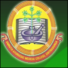

# Amrutha Ayurvedic Medical College

* Amrutha Ayurvedic Medical College**

| | |
| --- | --- |
| Type | Private |
| Established | 1996-97 |
| Location | Doddapete,Behind Onake Obavva,Stadium, Chitradurga - 577501 |
| Affiliations | Rajiv Gandhi University of Health Sciences |
| Website | http://www.amruthaayurcta.org |

**Course offered**

* Bachelor of Ayurvedic Medicine & Surgery
