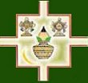

# Ashwini Ayurvedic Medical College

* Ashwini Ayurvedic Medical College**

| | |
| --- | --- |
| Type | Private |
| Established | 1992 |
| Location | Ashwini Nagar, Doddabathi post, P.B. Road, Davanagere-577 566 |
| Affiliations | Rajiv Gandhi University of Health Sciences |
| Website | http://www.aamctumkur.com/ |

**Course offered**

* B.A.M.S
