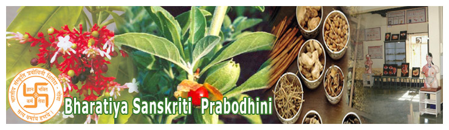

# Bhartiya Sanskrit Prabodhini Gomantak Ayurved Mahavidyalaya & Research Centre, Goa

* Bhartiya Sanskrit Prabodhini Gomantak Ayurved Mahavidyalaya & Research Centre**

| | |
| --- | --- |
| Type | Private |
| Established | 1993 |
| Location | North Goa, Goa |
| Affiliations | Goa University |
| Website | http://gamrc.org/GAMRC/ |

**Course offered**

* Ayurvedacharya (BAMS) (Bachelor of Ayurvedic Medicine & Surgery)
