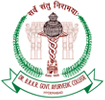

# Dr.BRKR Govt. Ayurved College, Hyderabad

* Dr.BRKR Govt. Ayurved College**

| | |
| --- | --- |
| Type | public |
| Established | 1935 |
| Location | S. R. Nagar, Erragadda, Hyderabad - 500038, Telangana State |
| Affiliations | NTR University of Health Sciences |
| Website | http://brkrgac.org/ |

**Course offered**

B.A.M.S. - Bachelor of Ayurvedic Medicine and Surgery (Ayurvedacharya & Ayurved Vachaspati.)
