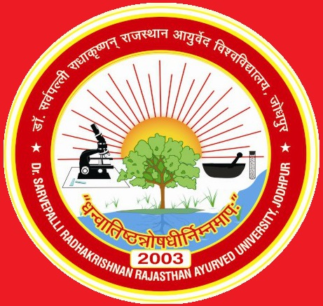

# Dr. Sarvepalli Radhakrishnan Rajasthan Ayurved University

* Dr. Sarvepalli Radhakrishnan Rajasthan Ayurved University**

| | |
| --- | --- |
| Type | Public |
| Established | 2003 |
| Location | Jodhpur, Rajasthan, India |
| Campus | Urban |
| Affiliations | UGC |
| Website | http://raujodhpur.org/ |

**Courses**

The university offers following degrees, diploma and certificate program:

* Ph.D(Ayurved)
* M.D.(Ayurved) / M.S.(Ayurved)
* M.D.(Homeopathy)
* Bachelor of Ayurvedic Medicine and Surgery (B.A.M.S.)
* Bachelor of Homeopathy Medicine and Surgery(B.H.M.S.)
* Bachelor of Unani Medicine and Surgery(B.U.M.S.)
* B. Pharma(Ayurveda)
* Bachelor of Naturopathy & Yoga Science (B.N.Y.S.)
* Diploma in AYUSH Nursing and Pharmacy(DAN & P)
* Panch Karma Technician Course
* Diploma in Herbal Farming
* Certificate Course in Ksharsutra
* Certificate Course in Panch Karma
* Certificate Course in Yoga & Naturopathy
* Diploma Course in Ayurveda for Medical Students
* Diploma Course in Ayurveda for foreigners
* Ayurveda Course for Allopathic Doctors
