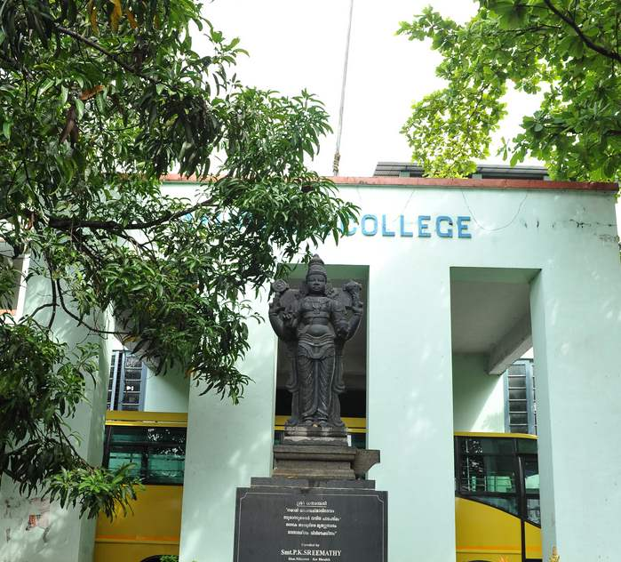

# Government Ayurveda College, Thiruvananthapuram

* Government Ayurveda College, Thiruvananthapuram**

| | |
| --- | --- |
| Type | Government Ayurveda College |
| Established | 1889 |
| Location | Thiruvananthapuram, Kerala, India |
| Affiliations | Kerala University of Health Sciences (KUHS) |
| Website | http://www.govtayurvedacollegetvm.nic.in/ |

**Course offered**

* BAMS
* MD(Ay)
* Panchakarma Therapy
* Nursing Assistant
* Pharmacist
