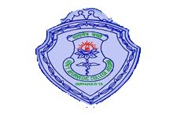

# Government Ayurvedic College, Guwahati

* Government Ayurvedic College, Guwahati**

| | |
| --- | --- |
| Type | Public |
| Established | 22 December, 1948 |
| Location | Jalukbari, Assam, Assam,, India |
| Campus | Urban |
| Affiliations | Srimanta Sankaradeva University of Health Sciences |
| Website | http://gacassam.webs.com/ |

Government Ayurvedic College is the first and only institute of Ayurveda in the entire North East India. It was established in the year 1948. The college is situated at Jalukbari, Assam. The College was previously affiliated by Gauhati University. Now the college have been brought under Srimanta Sankaradeva University of Health Sciences from 2010.

## Courses
**Graduate education**

* Degree awarded: Bachelor of Ayurvedic Medicine and Surgery (BAMS): 50 seats
* Duration of the course: Five and a half years including one-year internship.

Admission into BAMS course is based on Assam Combined Entrance Examination( Assam-CEE) conducted by Dibrugarh University.

**Postgraduate education**

* M.D. (Ayurved) in Kaya Chikitsa : 6 seats

* M.D. (Ayurved) in Samhita Siddhanta : 6 seats

* M.S. (Ayurved) in Shalya Tantra : 3 seats

* M.S. (Ayurved) in Prasuti Tantra & Stree Roga : 4 seats

* M.D. (Ayurved) in Roga Nidan : 3 seats

* M.D. (Ayurved) in Sharir Rachana : 2 seats

**Other courses**

* D. Pharm(Ayurveda) : 20 seats
