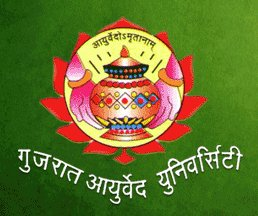

# Gujarat Ayurved University

* Gujarat Ayurved University**

| | |
| --- | --- |
| Type | Government of Gujarat |
| Established | 1967 |
| Location | Jamnagar |
| Campus | Urban |
| Affiliations | autonomous organization, fully funded by the Government of Gujarat. |
| Website | www.ayurveduniversity.edu.in/ |

## Course offered
* Ph.D. in Medicinal plants,
* M.Sc. in medicinal plants,
* Ph.D (Ayu),
* BAMS, MD (Ayu),
* B.Pharm (Ayu),
* D.Pharm (Ayu),
* M.Pharm (Ayu),
* PG Diploma in Yoga & Naturopathy,
* Introductory Course in Ayurveda and Certificate Course in Yoga and Naturopathy.
