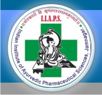

# Indian Institute of Ayurvedic Pharmaceutical Sciences

* Indian Institute of Ayurvedic Pharmaceutical Sciences**

| | |
| --- | --- |
| Type | Public |
| Established | 1999 |
| Location | Jamnagar, Gujarat, India |
| Campus | Urban |
| Affiliations | Gujarat Ayurved University |
| Website | http://www.ayurveduniversity.edu.in/ |

**Course offered**

* Diploma in Pharmacy (Ayurved) - D.Pharm. (Ayu)
* Bachelor of Pharmacy (Ayurved) - B.Pharm. (Ayu)
