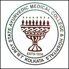

# JB Roy State Medical College

* JB Roy State Medical College**

| | |
| --- | --- |
| Type | Private |
| Established | 1916 |
| Location | Kolkata, West Bengal |
| Affiliations | West Bengal University of Health Sciences. |
| Website | www.jbroyayurvedacentenary.org/ |

**course offered**
* BAMS degree with intake capacity of 60
