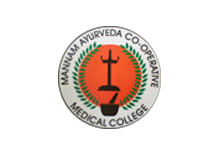

# Mannam Ayurveda Co-operative Medical College, Pandalam

* Mannam Ayurveda Co-operative Medical College, Pandalam**

| | |
| --- | --- |
| Type | Private |
| Established | 2005 |
| Location | Pandalam, Kerala, IndiaIndia |
| Campus | Rural, 30 acres |
| Affiliations | University of Kerala / Kerala University of Health Sciences |
| Website | http://www.mannammedicalcollege.org/ |

Mannam Ayurveda Co-operative Medical College is located in Mangaram, Pandalam and was founded in 2005. It is a self-financed college owned, financed and run by the Mannam Sugar Mills Co-operative Ltd. The college is affiliated with University of Kerala[3] and KUHS. The college offers bachelor's degree course in the field of Ayurvedic Medicine and Surgery.

## **Course offered**
* Bachelor of Ayurveda Medicine & Surgery(BAMS)
