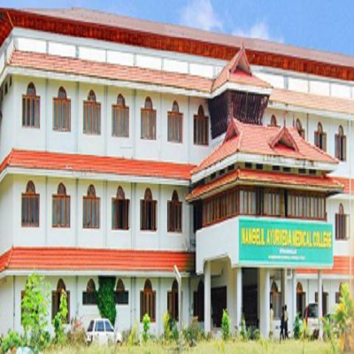

# Nangelil Ayurveda College

* Nangelil Ayurveda College**

| | |
| --- | --- |
| Type | Private |
| Established | 2002 |
| Location | Kothamangalam, in the Ernakulam district of Kerala, India |
| Affiliations | Mahatma Gandhi University, Kottayam |
| Website | http://nangelilayurvedamedicalcollege.org/ |

Nangelil Ayurveda College is an ayurvedic medical college, located in Kothamangalam, in the Ernakulam district of Kerala, India. The college, owned by the Nangelil Charitable Trust, is self-financing, and is affiliated to Mahatma Gandhi University, Kottayam and associated with Nangelil Ayurveda Hospital, Kothamangalam.

The college offers a five year Bachelor of Ayurvedic Medicine course, approved by Kerala University of Health science,Trichur. 60 seats are available for this course. The admission is partly from the Kerala State Medical Entrance.

## Course offered
* Ayurvedacharya (B.A.M.S.) Degree Course
* Ayurveda Therapist Course
