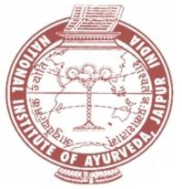

# National Institute of Ayurveda

* National Institute of Ayurveda**

| | |
| --- | --- |
| Type | Public |
| Established | February 7, 1976 |
| Location | Jaipur, Rajasthan, India |
| Campus | Urban |
| Affiliations | Dr. Sarvepalli Radhakrishnan Rajasthan Ayurved University |
| Website | http://www.nia.nic.in/ |

## Courses
The university offers following degrees, diploma and certificate program:

* Ph.D (Ayurved)
* M.D.(Ayurved) / M.S.(Ayurved)
* Bachelor of Ayurvedic Medicine and Surgery (B.A.M.S.)
* B. Pharma (Ayurveda)
* Diploma in AYUSH Nursing and Pharmacy (DAN & P)
* Panch Karma Technician Course
* Diploma in Herbal Farming
* Certificate Course in Kshar-Sutra
* Certificate Course in Panchakarma
* Certificate Course in Yoga & Naturopathy
* Diploma Course in Ayurveda for Medical Students
* Diploma Course in Ayurveda for foreigners
* Ayurveda Course for Allopathic Doctors
