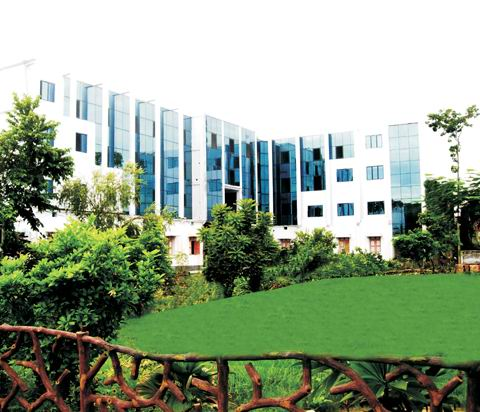

# Nitishwar Ayurved Medical College & Hospital, Muzaffarpur

* Nitishwar Ayurved Medical College & Hospital, Muzaffarpur**

| | |
| --- | --- |
| Type | Private |
| Established | 25th April, 1979 |
| Location | Bawanbigha, Kanholi, Muzaffarpur, Bihar |
| Campus | 10 acres of land |
| Affiliations | B.R.A. Bihar University, Muzaffarpur, Bawanbigha, Kanholi |
| Chairman | Mr. Nitishwar Prasad |

**Course offered**

B.A. M.S. (Bachelor of Ayurvedic Medicine and Surgery)

The degree has received recognition and approval of the Central Council of Indian Medicine (CCIM), New Delhi. The College is planning to start M.D. programs in the near future.
