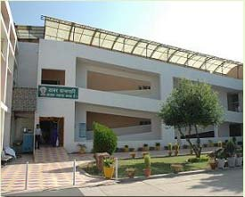

# Shri Dhanwantri Ayurvedic College

* Shri Dhanwantri Ayurvedic College**

| | |
| --- | --- |
| Type | Private |
| Chairman | Mr Gopal Das Kaushik |
| Location | Village Semri, Chhata, N.H-2 (New Delhi Side) Mathura (U.P.), INDIA. |
| Affiliations | ChhatraPati Sahuji Maharaj University & approved by CCIM, New Delhi. |
| Website | www.shridhanwantrigroup.com |

**Course Offered**

* Bachelor of Ayurvedic Medicine and Surgery
* Dimploma in OT Technician
* Diploma in Physiotherapy
