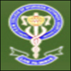

# Sri Dharmasthala Manjunatheshwara College of Ayurveda & Hospital

* Sri Dharmasthala Manjunatheshwara College of Ayurveda & Hospital**

| | |
| --- | --- |
| Type | Private |
| Established | 1992 |
| Location | Kuthpady, Udupi-574118 |
| Campus | Urban |
| Affiliations | RGUHS, Bangalore and Central Council of Indian Medicine, New Delhi. |
| Website | http://www.sdmcahhassan.org/ |

**Course offered**

**Under Graduate**

* B.A.M.S Degree Course

**Post Graduate**

* MD (Ayurveda)
* MS (Ayurveda)

**Ph.D**

* Doctor of Philosophy (Ph.D) 4 or 5 Years

## Colleges under SDM group include:
* SDM College of Ayurveda, Hassan
* SDM College of Dental Sciences, Dharwad
* SDM College of Engineering and Technology
* SDM Ayurveda Hospital, Hassan
* SDM Industrial Training Institute, Sam
* SDM Institute for Management Development, Mysore
* SDM College of Naturopathy & Yogic Sciences, Ujire
* SDM College, Ujire
* SDM & MMK Mahila Maha Vidyala, Mysore
* SDM Law College, Mangalore
* SDM College of Business Management, Mangalore
* SDM College of PGDBM Course, Mangalore
* SDM College of Ayurveda, Udupi
* SDM Ayurveda Pharmacy, Udupi
* SDM Ayurveda Hospital, Udupi
* SDM College of Physiotherapy, Dharwad
* SDM College of Medical Sciences, Dharwad
* SDM Industrial Training Institute, Venur
