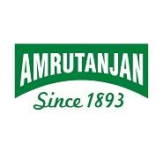

# Amrutanjan Healthcare

[TOC]

* Amrutanjan Healthcare**

| | |
| --- | --- |
| Type | Public |
| Key people | Kasinadhuni Nageswara Rao (Founder), S Sambhu Prasad (Chairman & Managing Director) |
| Products | medicine |
| Homepage | https://www.amrutanjan.com/ |
| Founded | 1893 |
| Location | No.103 (Old No.42-45), Luz Church Road, Mylapore, Chennai 600 004. |

**Amrutanjan Healthcare** is a manufacturer of Ayurvedic products based out of  Chamrajpet, Bengaluru, India.

## Registered Address
* No.103 (Old No.42-45), Luz Church Road, Mylapore, Chennai 600 004.

## Manufacturing Locations
* 135 & 135/3, 4TH MAIN, 9TH CROSS, Chamrajpet, Bengaluru, Karnataka 560018
* 135, 9th Cross Rd, Chamrajpet, Bengaluru, Karnataka 560018

## Drugs with COPP (Certificate of Pharmaceutical products)
## List of Products
### Presently available in market
* Headache Product
* Aromatic Balm
* Strong Balm
* Roll on
* Body Pain Product
* Back Pain Roll On
* Body Pain Creme
* Joint Muscle Spray
* Body Ache Gel Pad
* Congestion Management
* Relief Cold Rub
* Nasal Inhaler
* Relief Cough Syrup
* Relief Swas Mint
* Healthcare Products
* Comfy Sanitary Napkin
* Decorn Corn Caps
* Xpert Dermal Ointment
* Beverages
* Fruitnik

### List of proprietary products
* Headache Product
* Body Pain Product
* Congestion Management
* Healthcare Products
* Xpert Dermal Ointment
* Beverages

### Products that were available earlier
## Licenses Information
### Manufacturing licenses
## Trade marks registered
* Amrutanjan

## References

## External Links
* [Amrutanjan Healthcare on medindia.net](https://www.medindia.net/drugs/manufacturers/amrutanjan-health-care-ltd.htm)
* [Healthcare on wikipedia.org](https://en.wikipedia.org/wiki/Amrutanjan_Healthcare)

## References

1. [details"]("Product)(https://www.indiamart.com/amrutanjanhealthcare/products.html)
