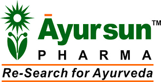

# Ayursun Pharma

[TOC]

* Ayursun Pharma**

| | |
| --- | --- |
| Type | Private |
| Key people | Dr. Sandip C Patel (Managing Director) and Founder of Ayursun Pharma |
| Products | Ayurvedic Medicines for Humans, Cattle, Animal, Poultry and Equine usage |
| Homepage | http://www.ayursun.in/ |
| Founded | 1992 |
| Location | 58, GIDC, Bhatpor Estate, Opp. ONGC, Magdalla-Hajira Road, Surat - 394510, Gujarat, India |
| Status | Operational |

**Ayursun Pharma** is an Indian Ayurvedic pharmaceutical company established by Vaidaratnam Sandip Patel in Surat in 1992.

## History
Ayursun Pharma''' was established as a patent Ayurvedic medicine business in Surat[1][2] in 1992 by Vaidaratnam Sandip Patel who is an Ayurvedic Doctor, Re-search Scientist, social reformer.

**Ayursun Pharma** Company Manufacturing Ayurvedic Medicines with Traditional and Modern technology. all medicines Manufacturing based on Indian Ayurveda Science.
The aim of the Ayursun Pharma Company is to make good Ayurvedic medicines through modern and traditional method. Which is economical and beneficial for all the people of the world.
Ayursun Pharma currently Manufacturing medicines in various division like as - Human, veterinary, Poultry, OTC, Single Herb Capsule, Shastrokta (Classical Medicines) makes all kinds of 700+ products. All medicines are made on the basis of international standard level quality.

## ITIS Oil
* the name of Ayursun ITIS oil very popular Brand. generally use for painful inflamation Condition. it is oil contain almost effective and potent herbal oil & Herbs they have the quality of penetrating deep inside the skin and mussles and give a quicker relief to painful part of the body.
* Launch 28 April 2020 Corovyl Syrup and Corovyl Tablet with Zota healthcare ltd.

## Products
Ayursun Pharma main Ayurvedic product Division is for human, animal & poultry, otc, Classical (Sastrokta) medicines, single herb capsules, kashayam etc. Ayursun Pharma launched a series of anti-diabetic medicines called Madhusudan Kalp Syrup, Anti cancer- Carcin Tablet in 1993. the company launched wide range of Ayurvedic Products day by day.

The Ayursun Pharma group also includes a Nueutraceutical company and Ayurvedic Hospital called Pratik Nutraceuticals and Niramay Ayurvedic Hospital.
## News update
* Launch 28 april 2020 Corovyl Syrup and Corovyl Tablet with Zota healthcare ltd.

## References

## External Links
* [On linkedin](https://in.linkedin.com/company/ayursunpharma)
* [Company profile](http://www.ayursunpharma.com/profile.html)

## References

1. [details](Product)(http://www.ayursun.in/products.html)
