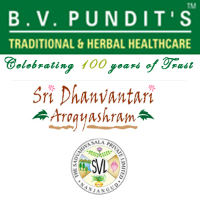

# B. V. Pundit's Traditional & Herbal Healthcare

[TOC]

* B V Pundits' Traditional & Herbal Healthcare**

| | |
| --- | --- |
| Type | Private |
| Founder | Shri B V Pundit |
| Products | Ayurvedic medicines |
| Homepage | https://www.indiamart.com/bvpundits-traditional-herbal-healthcare/ |
| Founded | 1913 |
| Location | The Sadvaidyasala Private Ltd., 13th Cross, M.G.S.Road, Nanjangud - 571 301, Karnataka, India |
| Standard Certifications | A GMP certified manufacturing facility |

B.V.Pundit or Sadvaidyasala is a household name synonymous with traditional Ayurvedic preparations, in Karnataka for over a century. B V Pundit and Nanjangud are also synonymous with Nanjangud Tooth Powder the flagship brand of Sadvaidyasala for several decades.

## Product Range
* Asavas & Arishtas

* Quathas

* Arkas

* Lehyam

* Churnas

* Ghrita

* Tailas

* Syrups

* Pills & tablets

* Ointments
* Miscellaneous.

* Bhavana Shunti
* Triphala Churna
* Sarasaparilla Syrup
* General Health
* Amala Juice Sugar Free
* Aloe Vera Juice
* Rose Gulkand Special
* Pure Rose Water
* Immunity Boosters
* Giloi T
* Ashwagandha Rasayana
* Joint care
* Ashwagandha Balalakshadi Taila
* Srikara Bhadanjana
* Dentrifice
* Nanjangud Tooth Powder 75g Container
* Irimedadi Taila
* Nanjangud Tooth Powder 18g
* Nanjangud Tooth Powder Economy Pouch 100g
* Hair Care
* Neela Hair Oil
* Henna Powder
* Massage Oils
* Bhringamalaka Taila

## External Links
* [B V Pundits' Traditional & Herbal Healthcare](http://www.sadvaidyasala.com/products.html)
