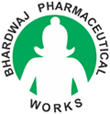

# Bhardwaj Pharmaceutical Works

[TOC]

* Bhardwaj Pharmaceutical Works**

| | |
| --- | --- |
| Type | Private |
| Key people | Dr. Hemanshu Bhardwaj, Mr. Rahul Bhardwaj |
| Products | Herbal Medicines and Herbal Care Products |
| Homepage | http://www.bhardwajayurvedicmedicine.com/ |
| Founded | 1993 |
| Location | Prakash Nagar, Near Navlakha, Indore - 452001, Madhya Pradesh, India |

**Bhardwaj Pharmaceutical Works** is a manufacturer of Ayurvedic products based out of  Indore, Madhya Pradesh, India.

## Registered Address
* Prakash Nagar, Near Navlakha, Indore - 452001, Madhya Pradesh, India

## Manufacturing Locations
* Prakash Nagar, Near Navlakha, Indore - 452001, Madhya Pradesh, India

## Drugs with COPP (Certificate of Pharmaceutical products)
## List of Products
### Presently available in market
* Erend Haritki Tabs
* Hardyavallabh Syrup
* Hardyavallabh Tab
* Hemorin Tabs
* Hemovin Syrup
* Herbo Hair Care Oil
* Herbo Hair Care Tabs
* Kodnil Syrup
* Kodnil Tabs and others

### List of proprietary products
### Shodhit Dravya
* GANDHAK AMLASAR
* HARTAL VARKI
* KAJJALI
* KUCHALA
* SHILAJEET SURYATAPI
* VATSANABH KRUSHNA
* SHILAJEET TARAL

* Ayurvedic Amoebiasis Syrup
* Ayurvedic Energizer Medicines
* Intestinal Worms Ayurvedic Syrup
* Ayurveda Hypertension Syrup
* Ayurvedic Anaemia Treatment Syrup
* Ayurvedic Leucoderma Treatment Medicine
* Ayurvedic Memory Booster Syrup
* AYURVEDIC MEDICINE FOR PILES
* Ayurvedic Hyperacidity Syrup
* Ayurvedic Skin Diseases Medicine
* Ayurvedic Arthritis Treatment Syrup
* Ayurvedic Swelling Treatment Medicine

* Ayurvedic Calcium Tablets
* Ayurvedic Anti Cholesterol Tablet
* Ayurvedic Constipation Tablet
* Ayurvedic Headache Tablet
* Ayurvedic Hypothyroidism Tablet
* Ayurvedic Low Blood Pressure Medicine
* Ayurvedic Insomnia Medicine
* Ayurvedic Eye Tonic
* Ayurvedic Hyperacidity Medicine
* Ayurvedic Urticaria Medicine
* Ayurvedic Hair Fall Oil
* Ayurvedic Dermatitis Medicine
* CHANDANBALA LAKSHADI TAILA
* ERIMEDADI TAILA
* JATYADI TAILA
* KASISADI TAILA
* KSHAR TAILA
* KUMKUMADI TAILA
* MAHAMARICHYADI TAILA
* MAHAMASHA TAILA
* MAHANARAYAN TAILA
* MAHAVISHGARBH TAILA
* ABHRAK BHASMA 100 PUTI
* ABHRAK BHASMA 1000 PUTI
* ABHRAK BHASMA
* AKIK BHASMA
* BANG BHASMA
* GODANTI BHASMA
* HAJRUL YAHUD BHASMA
* JASAD BHASMA
* JAHAR MOHRA BHASMA
* KANTA LOHA BHASMA
* KAPARDIKA BHASMA
* KASIS BHASMA
* PUSHYANUG CHURNA NO.2
* AJMODADI CHURNA
* AMAL KI RASAYANA
* ASHWAGANDHADI CHURNA
* AVIPATTIKAR CHURNA
* CHOPCHINYADI CHURNA
* DASHANG LEP
* HINGVASHTAK CHURNA
* LAVAN BHASKAR CHURNA
* MAHASUDARSHAN CHURNA
* PANCHSAKAR CHURNA
* SHIVAKSHAR PACHAN CHURNA
* AGNI KUMAR RAS
* AMAVATARI VATI
* ANAND BHAIRAV RAS
* AROGYAVARDHANI VATI
* ARSH KUTHAR RAS
* ARSHAGNI VATI
* ASHWA KANCHUKI RAS
* BOL BEDHA RAS
* BRAHMI VATI
* CHANDRAKALA RAS
* CHANDRAMRIT RAS
* EKANGVEER RAS
* AKIK PISHTI
* HAJRUL YAHUD PISHTI
* JAHAR MOHRA KHATAI PISHTI
* KAHARWA PISHTI
* MUKTA SHUKTI PISHTI
* BOL PARPATI
* PANCHAMRIT PARPATI
* RASA PARPATI
* SHWET PARPATI
* AMRITA GUGGULU
* GOKSHURADI GUGGULU
* KAISHORE GUGGULU
* KANCHNAR GUGGULU
* LAKSHADI GUGGULU
* MAHAYOGRAJ GUGGULU
* MEDOHAR GUGGULU
* PANCHAMRIT LOHA GUGGULU
* PANCHATIKTA GHRIT GUGGULU
* PUNARNAVA GUGGULU
* RASNADI GUGGULU
* SAPTAVISHANTI GUGGULU
* AMLA PITTANTAK LOHA
* DHATRI LOHA
* MEDOHAR VIDANGADI LOHA
* NAVAYAS LOHA
* PRADRANTAK LOHA
* SAPTAMRIT LOHA
* SARVA JVARHAR LOHA
* SHOTHARI LOHA
* TAPYADI LOHA( ROUPYA)
* TRUSHNADI LOHA
* VIDANGADI LOHA
* VISHAM JVARANTAK LOHA
* MALLA SINDUR
* RAS SINDUR
* SAMIR PANNAG RAS
* SHILA SINDUR
* SWARNA BANG
* AGNITUNDI VATI
* CHANDANADI VATI
* CHANDRAPRABHA VATI
* CHITRAKADI VATI
* ELADI VATI
* KANKAYAN VATI (ARSH)
* KHADIRADI VATI
* KUTAJ GHANA VATI
* LASHUNADI VATI
* LAVANGADI VATI
* MAHASHANKH VATI
* RAJAH PRAVARTANI VATI
* ABHAYARISHTA
* SARIVADYASAVA
* AMRITARISHTA
* ARJUNARISHTA
* ARVINDASAVA
* ASHOKARISHTA
* ASHWAGANDHARISHTA
* BALARISHTA
* BHRINGRAJASAVA
* CHANDANASAVA
* DASHMULARISHTA
* DRAKSHASAVA
* CHYVANPRASH AVALEHA
* DADIMAVALEHA
* DRAKSHAVALEHA
* HARIDRA KHAND
* SUPARI PAK
* ASHWAGANDHA GHANA
* BHRINGRAJ GHANA
* DASHMOOL GHANA
* GUDUCHI GHANA
* MAHAMAJISHTHADI GHANA
* MAHARASNADI GHANA
* MAHASUDARSHAN GHANA
* APAMARG KSHAR
* Ark Kshar
* Muli Kshar
* NARIKE LAVANA
* VAJRA KSHAR
* YAVAK KSHAR
* MANIKYA BHASMA
* MOTI BHASMA
* MOTI PISHTI
* PANNA PISHTI
* ROUPYA BHASMA
* SWARNA BHASMA
* SWARNA SAMEER PANNAG
* VAJRA (HIRAK) BHASMA
* VAIKRANT BHASMA
* BASANT KUSUMAKAR RAS
* CHATURMUKH RAS
* CHINTAMANI CHATURMUKH RAS
* JAYMANGAL RAS
* KAMDUGDHA RAS (MOTI YUKTA)
* KUMAR KALYAN RAS
* Mahalaxmi Vilas Ras
* Makardhwaj Vati
* Praval Panchamrit (MOTI Yukta)
* Ras Raj Ras
* Shwaskas Chintamani Ras
* Swarna Brahmi Vati
* Ayurvedic Anti Diabetic Capsules
* Ayurvedic Weight Loss Capsules
* Ayurvedic Anti Stress Medicine
* Bhardwaj Ashwagandha Capsules
* Bhardwaj Shilajeet Capsules
* yurvedic Medicine For Menstrual Disorders
* Ayurvedic medicine for physical strength

### Products that were available earlier
## Licenses Information
### Manufacturing licenses
## Trade marks registered
* Bharadwaj

## References

## External Links
* [Company Profile](http://www.bhardwajayurvedicmedicine.com/)
* [More products](http://bhardwajpharmaceuticalworks.com/)

## References

1. [details"]("Product)(http://www.bhardwajayurvedicmedicine.com/products.html)
