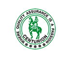

# Centurion Remedies Private Limited

[TOC]

* Centurion Remedies Private Limited**

| | |
| --- | --- |
| Type | Private |
| Key people | Ambalal Patel(CEO) |
| Products | Veterinary and Allopathic Products |
| Homepage | http://www.centurionlaboratories.in/ |
| Founded | 1995 |
| Location | Industrial Estate Gorwa, Vadodara - 390016, Gujarat, India |
| Standard Certifications | WHO GMP & ISO 9001:2000 certified |

Centurion Remedies Private Limited is a one of the leading manufacturers, suppliers and exporters of a wide range of Veterinary, Herbal and Allopathic Products in Gujarat.

## Products
* [Herbal Medicines](../medicines/Herbal_Medicines.md)
* Ayurvedic Products
* Ayurvedic Medicines
* Herbal Products

**S N Pandit Ayurvedic Company Pvt Ltd** is a manufacturer of Ayurvedic products based out of  Mysuru, Karnataka, India.

## Registered Address
* 25 & 26, Hootagalli Industrial Area, Automotive Axel Factory, Hootagalli, Mysuru, Karnataka 570018

## Manufacturing Locations
* 25 & 26, Hootagalli Industrial Area, Automotive Axel Factory, Hootagalli, Mysuru, Karnataka 570018

## Drugs with COPP (Certificate of Pharmaceutical products)
## List of Products
### Presently available in market
* Herbal Medicines
* Ayurvedic Products
* Ayurvedic Medicines
* Herbal Products

### List of proprietary products
* Herbal Medicines
* Ayurvedic Products
* Ayurvedic Medicines
* Herbal Products

### Products that were available earlier
## Licenses Information
### Manufacturing licenses
## Trade marks registered
## References

## External Links
* [More products](http://www.centurionlaboratories.in/)
* [Remedies](http://centurionremedies.com/)

## References

1. [details"]("Product)(https://www.indiamart.com/centurionremedies/products.html)
