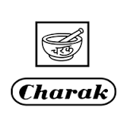

# Charak pharma pvt ltd

[TOC]

* Charak Pharmaceuticals**

| | |
| --- | --- |
| Type | Private |
| Key people | Shri D.N. Shroff and Dr. S.N. Shroff |
| Products | ayurvedic and herbal medicines |
| Homepage | http://charak.com/ |
| Founded | 1947 |
| Location | Charak Pharma Pvt. Ltd 501/A, Poonam Chambers,Dr. Annie Besant Road, Worli, Mumbai – 400 018. |
| Standard Certifications | Certificate of good manufacturing practicing, NABL certificate, ISO 9001:2015 certificate, DSIR recognition certificate. |

**charak pharma pvt ltd** is a manufacturer of Ayurvedic products based out of  Mumbai, Maharashtra, India.

## Registered Address
* Charak Pharma Pvt. Ltd, 501/A, Poonam Chambers, Dr. Annie Besant Road, Worli, Mumbai – 400 018

## Manufacturing Locations
* Location 1 : Charak Pharma Pvt. Ltd, 501/A, Poonam Chambers, Dr. Annie Besant Road, Worli, Mumbai – 400 018.

* Location 2 : 21, Evergreen Industrial Estate, 2nd Floor, Opposite-Dr. E. Moses Road, Shakti Mills Ln, Lower Parel, Mumbai, Maharashtra 400011.

## Drugs with COPP (Certificate of Pharmaceutical products)
## List of Products
### Presently available in market
* Addyzoa Capsule
* ADDYZOA TABLETALKA
* 5 SyrupAlsarex Forte
* Tablet
* ALSAREX
* TABLETCALCURY TABLET
* Cephagraine
* Nasal
* DropsCharak
* Aptizooom
* SyrupCharak
* Calcury
* TabletCharak
* Cephagraine Tablet
* Charak Ojus Syrup
* Charak Pigmento Tablet
* Charak Spasma Syrup
* CHROPAXE TABLET
* Cognium Tablet
* Cytozen Capsule
* Evanova Capsule
* Evenshade Cream
* Extrammune Tablet
* Femiforte Tablet
* Femiplex Tablet
* Hyponidd Tablet
* Kofol Lozenges Mint
* M2TONE FORTE SYRUP
* M2TONE
* SYPM2TONE
* SYPM2TONE TABLET
* MANOLL NATURAL HEALTH TONIC
* MOHA MOISTURIZING LOTION
* Neo Tablet
* OJUS SYP
* Ostolief
* Nutra Tablet
* OSTOLIFE TABLET
* PALLRYWYN FORTE TABLET
* PIGMENTO OINTMENT
* PACKPIGMENTO TABLET
* PILIEF TABLET
* PROSTEEZ TABLET
* REGULAX FORT TABLET
* Regulax Forte Tablet
* RICHELTH CAPSULE
* Rymanyl Capsule
* SKINELLE CREAM
* SPASMA SYP
* Spasma Syrup
* Stop-Ibs Tablet
* STOPIBS TABLET
* TAKZEMA OINT
* Takzema Ointment
* TAKZEMA TABLET
* Urtiplex Anti-Itch Lotion
* URTIPLEX CAPSULE
* URTIPLEX LOTION
* Vigomax Forte Tablet
* VIGOROLL JELLY
* Vomiteb Syrup
* ZZOWIN TABLET

### List of proprietary products
* Women’s health products
* Men’s health products
* Children’s health products
* Immune health products
* urology products
* digestive & derma care products
* obesity
* arthritis
* chronic pain
* Kofol Gargle
* Kofol Lozenges Jar (Honey Lemon)
* Kofol Lozenges Jar (Orange)
* Kofol Lozenges Jar (Mint)
* Moha Soap
* Herbal Sunscreen Lotion
* Herbal Scrub
* Herbal Hair Serum
* Zoazest Nutra
* Expijoy Nutra
* Gynelth Nutra
* Cystolib-Capsuleslr
* M2-Tone EM Syrup
* Endotone Capsules
* Hyponidd Tablet

### Products that were available earlier
* Nutrition products

## Licenses Information
### Manufacturing licenses
No : 127072

## Trade marks registered
**Charaka**

## References

## External Links
* [Charaka Pharma on charak.com](https://charak.com/product-category/healthcare/)
* [Charaka Pharma on chemistsworld.com](https://www.chemistsworld.com/manufacturers/charak-pharma-pvt-ltd.html)

## References

1. [details"]("Product)(https://www.1mg.com/manufacturer/charak-pharma-pvt-ltd-56878)
