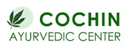

# Cochin Ayurvedic Centre

[TOC]

* Cochin Ayurvedic Centre**

| | |
| --- | --- |
| Type | Private |
| Key people | Mr. Bastian Suresh (Proprietor) |
| Products | Ayurveda and Herbal based medicines and food supplements |
| Homepage | http://cochinayurvedic.tradeindia.com/ |
| Founded | 1988 |
| Location | 33, New Municipal D/S Market, Lodhi Colony, New Delhi - 110003, India |
| Status | Operational |

**S N Pandit Ayurvedic Company Pvt Ltd** is a manufacturer of Ayurvedic products based out of  Mysuru, Karnataka, India.

## Registered Address
* 33, New Municipal D/S Market, Lodhi Colony, New Delhi - 110003, India

## Manufacturing Locations
* 33, New Municipal D/S Market, Lodhi Colony, New Delhi - 110003, India

## Drugs with COPP (Certificate of Pharmaceutical products)
## List of Products
### Presently available in market
* Pinda Taila
* Maha kanaka Taila
* Dhanvantra Taila
* Bala Aswagandha Lakshadi
* Kesha Sanjeevini Taila
* Maha Bringamalaka Taila
* Drakshadi Paka
* Sarasaparilla Syrup (Sogadeberina sharabattu)
* Suvirechan
* Triphala Choorna
* Trikatu choorna
* Sitopaladi choorna

### List of proprietary products
* Aloe Vera Juice
* Ayurvedic Herbal Medicines
* Ayurvedic Soap
* Ayurvedic Syrups

### Products that were available earlier
## Licenses Information
### Manufacturing licenses
## Trade marks registered
## References

## External Links
* [On justdial.com](https://www.justdial.com/Delhi/Cochin-Ayurvedic-Centre-New-Municipal-D-S-Market-Lodhi-Colony/011PXX11-XX11-140603200622-B4M6_BZDET)
* [On medylife.com](https://www.medylife.com/delhi/ayurvedic/cochin-ayurvedic-centre)

## References

1. [details"]("Product)(https://www.tradeindia.com/Seller-344065-COCHIN-AYURVEDIC-CENTRE/Essential-Oils-Aromatics-931.html)
