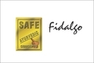

# Fidalgo Health Care

[TOC]

* Fidalgo Health Care**

| | |
| --- | --- |
| Type | Private |
| Key people | Jasmeet Singh(CEO) |
| Products | Ayurvedic Medicines and Health Supplements |
| Homepage | http://www.indiamart.com/fidalgo-health-care/ |
| Founded | 1998 |
| Location | Dhandari Kalan, Ludhiana - 141010, Punjab, India |
| Status | Operational |

**Fidalgo Health Care** is a manufacturer of Ayurvedic products based out of  Ludhiana, Punjab, India.

## Registered Address
* Dhandari Kalan, Ludhiana - 141010, Punjab, India

## Manufacturing Locations
* Opposite Dhandari Railway Station, Dhandari Kalan, Ludhiana-141014, Punjab, India

## Drugs with COPP (Certificate of Pharmaceutical products)
## List of Products
### Presently available in market
* Fidalgo Hair Care
* Weight Management
* Fidalgo's Herbal Medicines
* Pain Relief
* Fidalgo's Liver Tonic
* Herbal Laxative
* Health Supplements
* Amla Juice
* Memory Enhancement Capsule

### List of proprietary products
* Cojoint Capsules
* Cojoint Gel
* Orthrex Capsules
* Cojoint Oil
* Cough Syrup
* Coff-7 SF Syrup
* Delmi Syrup
* Honeycof Syrup

### Products that were available earlier
## Licenses Information
### Manufacturing licenses
## Trade marks registered
## References

## External Links
* [Fidalgo Health Care on indiamart.com](https://www.indiamart.com/fidalgo-health-care/profile.html)
* [Fidalgo Health Care on tradeindia.com](https://www.tradeindia.com/Seller-6655499-Fidalgo-Health-Care/)

## References

1. [details"]("Product)(https://www.indiamart.com/fidalgo-health-care/)
