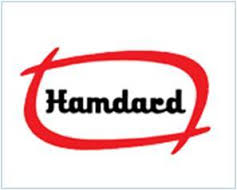

# Hamdard Laboratories India

[TOC]

* Hamdard Laboratories**

| | |
| --- | --- |
| Type | company |
| Key people | Hakeem Hafiz Abdul Majeed |
| Products | Unani'' and Ayurvedic pharmaceutical |
| Homepage | http://www.hamdard.in |
| Founded | 1906 |
| Location | Delhi |
| Status | Operational |

**Hamdard** is a manufacturer of natural and herbal products based out of Delhi.

## Registered Address
Hamdard Building, 2A/3 Asaf Ali Road, New Delhi-110002, India.Phone No's. : +91-11-23239801-4, 23221027, 23215307

## Manufacturing Locations
* Ghaziabad (U.P.), Address : B-1, B-2/III, Industrial Area, Ghaziabad. Phone No : 120-2712273,120-2712193
* Manesar (Haryana), Address : Plot 12-15, Sector-7, IMT Manesar, Gurgaon. Phone No : 124-2290988,124-2290989
* Okhla (Delhi), Address : B-317-318, Okhla Industrial Area Phase-1, New Delhi. Phone No : 011-42575351

## Drugs with COPP (Certificate of Pharmaceutical products)
## List of Products
### Presently available in market
* Pharmaceutical Formulations
* Hair Care Products
* Beverages
* Also Listed in
* Hair Oil
* Hamdard Hair Oil
* Syrup

### List of proprietary products
* Sharbat Rooh Afza
* Safi
* Roghan Badam Shirin
* Sualin
* Joshina
* Cinkara.

### Products that were available earlier
## Licenses Information
### Manufacturing licenses
## Trade marks registered
* Hamdard Memoprash
## References

## External Links
* [On indiamart.com](https://www.indiamart.com/hamdard-laboratories/aboutus.html)
* [Company Brand](http://www.hamdard.in/brand)

## References

1. [details"]("Product)(https://www.tradeindia.com/Seller-12879178-HAMDARD-LABORATORIES-INDIA/product-services.html)
