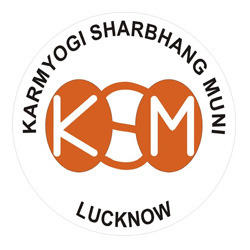

# Karmyogi Sharbhang Muni

[TOC]

* Karmyogi Sharbhang Muni**

| | |
| --- | --- |
| Type | Private |
| Key people | Mr. Navneet Agarwal (Managing Director) |
| Products | Herbal Medicines/Products |
| Homepage | http://karmayogisharbhangmuni.tradeindia.com/ |
| Founded | 1980 |
| Location | No. 323, New Ganeshganj, Opposite Soni Market, Aminabad Road, Lucknow - 226018, Uttar Pradesh, India |
| Status | Operational |

**Karmyogi Sharbhang Muni** is a manufacturer of Ayurvedic products based out of  Lucknow, Uttar Pradesh, India.

## Registered Address
* 323, Aminabad Rd, New Ganesh Ganj, Raniganj, Naka Hindola, Lucknow, Uttar Pradesh 226018

## Manufacturing Locations
* 323, Aminabad Rd, New Ganesh Ganj, Raniganj, Naka Hindola, Lucknow, Uttar Pradesh 226018

## Drugs with COPP (Certificate of Pharmaceutical products)
## List of Products
### Presently available in market
* Ayurvedic Medicines
* Rawano Drad Rahat Tel
* Kanmula Ear Drops
* Rawano Chyawanprash
* Gulab Jal Drop
* Ayurvedic Eye Drops
* Nayan Jyoti Eye Drops
* Ayurvedic Churna
* Rawano Anardana Churna
* Ayurvedic Sharbat / Syrup
* Sharbat Gulabl Syrup
* Sharbat Khas Syrup
* Ayurvedic Manjan
* Ayurvedic Dant Manjan
* Rawano Rishi Dant Sodhan Churna

### List of proprietary products
* Ayurvedic Syrup
* Gulab Syrup
* Haniysta Cough Syrup
* Khus Syrup
* Ayurvedic Churna
* Talisomadi Churan
* Rawano Pachan Churan
* Lavan Bhasker Churan
* Trifla Churan

### Products that were available earlier
## Licenses Information
### Manufacturing licenses
## Trade marks registered
## References

## External Links
* [Company profile](https://www.indiamart.com/karmayogi/profile.html)
* [Contact information](http://www.kysmindia.com/contact_us.html)

## References

1. [details"]("Product)(https://www.tradeindia.com/Seller-5088897-KARMYOGI-SHARBHANG-MUNI/product-services.html)
