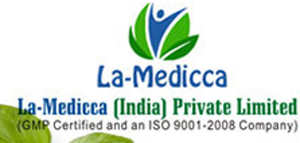

# LA-Medicca India Private Limited

[TOC]

* LA-Medicca India Private Limited**

| | |
| --- | --- |
| Type | Private |
| Key people | Mr. Amit Jain (Managing Director) |
| Products | Ayurvedic Products |
| Homepage | http://www.la-medicca.net/ |
| Founded | 1988 |
| Location | Plot No-168, Sector 7, Imt Manesar, Imt Manesar, Gurugram, Haryana 122050 |
| Status | Operational |

**LA-Medicca India Private Limited** is a manufacturer of Ayurvedic products based out of  Gurugram, Haryana, India.

## Registered Address
* Plot No-168, Sector 7, Imt Manesar, Imt Manesar, Gurugram, Haryana 122050

## Manufacturing Locations
* Plot No-168, Sector 7, Imt Manesar, Imt Manesar, Gurugram, Haryana 122050

## Drugs with COPP (Certificate of Pharmaceutical products)
## List of Products
### Presently available in market
* Aromatic Pillows

* Herbal Extracts

* Ayurvedic Products
* Artho Ease
* Asthma Ease
* Diabet
* Dizolax Powder
* Equibrom
* Hair Care
* Hyper Ease
* Single Herb Capsules
* Essential Oils
* Oil
* Raw Materials, etc

### List of proprietary products
* Kusum Oil
* Aromatic Pillows
* Dream Pillow
* Hang Over Pillow
* Happiness Aromatic Pillow
* Kapha Aromatic Pillow
* Ayurvedic products
* Adhatoda Vasika Capsules
* Aegle Marmelos Capsules
* Allium Sativum Capsules
* Asthma Ease Capsule
* Single Herb Capsules
* Azadirachta Indica Capsules
* Bacopa Monnieri Capsules
* Bauhinia Variegata Capsules
* Momordica Charantia Capsules

### Products that were available earlier
## Licenses Information
### Manufacturing licenses
## Trade marks registered
## References

## External Links
* [About Company](https://www.indiamart.com/lamedicca-india/aboutus.html)
* [On tradeindia.com](https://www.tradeindia.com/Seller-302055-LA-MEDICCA-INDIA-PRIVATE-LIMITED/product-services.html#contact-form)

## References

1. [details"]("Product)(https://www.tradeindia.com/Seller-302055-LA-MEDICCA-INDIA-PRIVATE-LIMITED/product-services.html)
