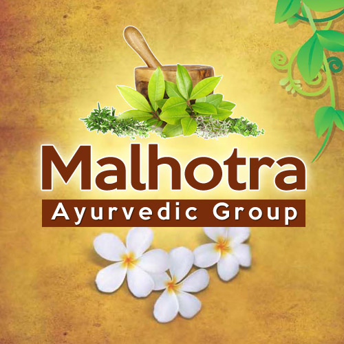

# Malhotra Ayurvedic Group

[TOC]

* Malhotra Ayurvedic Group**

| | |
| --- | --- |
| Type | Private |
| Key people | Mr. Mukhil Malhotra (Proprietor) |
| Products | Ayurvedic Medicines |
| Homepage | http://www.stoneayurvedicmedicine.com/ |
| Founded | 2001 |
| Location | 248/11, 1st Floor, New Char Chaman, Karnal - 132001, Haryana, India |
| Annual Turnover | INR 2 Crores |
| Status | Operational |

**Malhotra Ayurvedic Group** is a manufacturer of Ayurvedic products based out of  Karnal, Haryana, India.

## Registered Address
* 248/11, 1st Floor, New Char Chaman, Karnal - 132001, Haryana, India

## Manufacturing Locations
* 248/11, 1st Floor, New Char Chaman, Karnal - 132001, Haryana, India

## Drugs with COPP (Certificate of Pharmaceutical products)
## List of Products
### Presently available in market
* Ayurvedic Syrups
* Ayurvedic Powders
* Kidney Stone Ayurvedic Medicine
* Gastric Powder
* Period Problem Syrup / Irregular Menstruation Syrup
* Ayurvedic Grincuff Cough Syrup
* Hit To Stone Powder

### List of proprietary products
* Ayurvedic Syrups
* Ayurvedic Powders

### Products that were available earlier
## Licenses Information
### Manufacturing licenses
## Trade marks registered
## References

## External Links
* [About Company](http://malhotraayurveda.in/?page_id=786)
* [Malhotra Ayurvedic Group on tradeindia.com](https://www.tradeindia.com/fp3359683/Joint-Pain-Relief-Powder.html)

## References

1. [details"](http://malhotra-ayurvedic-group.shopclues.com/top_seller_products.php"Product)
