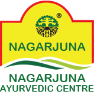

# Nagarjuna Ayurvedic Group

[TOC]

* Nagarjuna Ayurvedic Group**

| | |
| --- | --- |
| Type | Private |
| Key people | Dr. Madhavachandran, Director |
| Products | Ayurvedic products |
| Homepage | http://www.nagarjunaayurveda.com/index.aspx |
| Location | Kalayanthani PO, Thodupuzha, Kerala, India - 685 588 |
| Status | Operational |

**Nagarjuna Ayurvedic Group** is a manufacturer of Ayurvedic products based out of  Thodupuzha, Kerala, India.

## Registered Address
* Kalayanthani PO, Thodupuzha, Kerala, India - 685 588

## Manufacturing Locations
* Kalayanthani PO, Thodupuzha, Kerala, India - 685 588

## Drugs with COPP (Certificate of Pharmaceutical products)
## List of Products
### Presently available in market
* Traditional (Classical / Generic) Ayurvedic products – belongs to various classical product presentations
* Branded Ethical Proprietary products – either curative or supportive for health
* Herbal Products for personal care, mainly sold Over-The-Counter – belongs to health care, hair care, child care,dental care and personal care categories
* Exports Speciality Portfolio of Products – includes speciality health care products, health supplements, herbal teas, single herbs, massage oils and speciality *personal care products including herbal bath soaps

### List of proprietary products
* Hair Oil
* Facial Kit's
* Face Wash
* Herbal Hair Dye & Colour
* Balm
* Body Massage Oil
* Food Products
* Joint Pain Oil
* Face Cream & Gel
* Herbal Shampoo

### Products that were available earlier
## Licenses Information
### Manufacturing licenses
## Trade marks registered
## References

## External Links
* [S N Pandit Ayurvedic Company Pvt Ltd on indiamart.com Nagarjuna Ayurvedic Group on ayurvedmart.com](hhttp://www.ayurvedmart.com/316-nagarjuna-ayurvedic-groupttps://www.indiamart.com/sn-pandit-sons/profile.html)
* [Profole of the company](https://www.nagarjunaayurveda.com/)

## References

1. [details"]("Product)(https://www.nagarjunaayurveda.com/ayur-products/)
