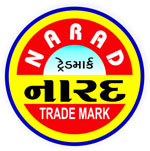

# Narad Aushadh Bhandar

[TOC]

* Narad Aushadh Bhandar**

| | |
| --- | --- |
| Type | Private |
| Key people | Mr. Abhay Soneji (Proprietor) |
| Products | Herbal & Ayurvedic Products |
| Homepage | http://www.naradaushadhbhandar.com/ |
| Founded | 1945 |
| Location | Bapuni Wadi, Rajkot, Jetpur - 360370, Gujarat, India |
| Status | Operational |

**Narad Aushadh Bhandar** is a manufacturer of Ayurvedic products based out of  Jetpur, Gujarat, India.

## Registered Address
* Bapuni Wadi, Rajkot, Jetpur - 360370, Gujarat, India

## Manufacturing Locations
* Bapuni Wadi, Rajkot, Jetpur - 360370, Gujarat, India

## Drugs with COPP (Certificate of Pharmaceutical products)
## List of Products
### Presently available in market
* Herbal Products
* Ayurvedic Medicines
* Herbal Oil
* Foram Herbal Powder
* Coldrawin Powder
* Ghass Tail
* Stonex Powder
* Weigro Powder
* Face Cream
* Weight Loss Powder
* Weight Gain Powder
* Teeth Powder

### List of proprietary products
* Ayurvedic medicine
* Herbal products
* Narad prinil powder
* Ayurveda herbal shampoo
* Narad wei-gro powder
* Narad Ghass Tail
* Narad dant rankshak powder
* Narad stonex powder
* Narad redex Powder
* Churna

### Products that were available earlier
## Licenses Information
### Manufacturing licenses
## Trade marks registered
* NARAD AUSHADH BHANDAR

## References

## External Links
* [Narad Aushadh Bhandar on tradeindia.com](https://www.tradeindia.com/Seller-10214997-NARAD-AUSHADH-BHANDAR/)
* [Narad Aushadh Bhandar on nmpb.nic.in](https://www.nmpb.nic.in/content/narad-aushadh-bhandar-bapuni-wadi-jetpur)

## References

1. [details"]("Product)(https://www.indiamart.com/narad-herbalproduct/)
