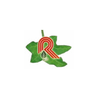

# Rucha Pharmaceuticals Private Limited

[TOC]

* Rucha Pharmaceuticals Private Limited**

| | |
| --- | --- |
| Type | Private |
| Key people | Mrs. Nitaben Goswami (Managing Director) |
| Products | Ayurvedic Products |
| Homepage | http://ruchaherbal.tradeindia.com/ |
| Founded | 1989 |
| Location | Ramji Mandir Bardolpura, O/s. Dariyapur Gate, Ahmedabad - 380016, Gujarat, India |
| Status | Operational |

**Rucha Pharmaceuticals Private Limited** is a manufacturer of Ayurvedic products based out of  Ahmedabad, Gujarat, India.

## Registered Address
* Ramji Mandir Bardolpura, O/s. Dariyapur Gate, Ahmedabad - 380016, Gujarat, India

## Manufacturing Locations
* Ramji Mandir Bardolpura, O/s. Dariyapur Gate, Ahmedabad - 380016, Gujarat, India

## Drugs with COPP (Certificate of Pharmaceutical products)
## List of Products
### Presently available in market
* Ayurvedic Medicine
* Ayurvedic Height Boosting Capsules
* Ayurvedic Eye Bright Capsules
* Ayurvedic Memory Pills
* Weight Loss Products
* Relax Massage Oil
* Ayurvedic Weight Loss Supplement
* Herbal Skincare Products
* Herbal Face Cleaner
* Herbal Skin Care Products Range
* Herbal Skin Tonic Oil
* Herbal Face Care Products
* Other Products
* Ayurvedic Beauty Spa Products
* Ayurvedic Skincare Cream
* Ayurvedic Hair Oil
* Hair Oil

### List of proprietary products
* Ayurvedic Medicine
* Weight Loss Products
* Herbal Skincare Products
* Ayurvedic Beauty Spa Products
* Ayurvedic Skincare Cream
* Ayurvedic Hair Oil
* Hair Oil

### Products that were available earlier
## Licenses Information
### Manufacturing licenses
## Trade marks registered
* NIKHAR TALC POWDER
* PIMPLOX TALET
* GREAST TAIL
* BHRHMI BHRUNGRAJ TAIL
* PIMPLOX TALET
* GREAST TAIL
* BHRHMI BHRUNGRAJ TAIL
* KESHTONE LIQUID (WOMAN DEVICE)
* SNANDUST
* MEDHA PILS
* SIMPLOX (label)
* KESHRUCHI TABLET`
* VRDDHI CAP. (LABEL)

## References

## External Links
* [Rucha Pharmaceuticals Private Limited on tradeindia.com](https://www.tradeindia.com/Seller-356561-RUCHA-PHARMACEUTICALS-PVT-LTD-/)
* [Rucha Pharmaceuticals Private Limited on indiamart.com](https://www.indiamart.com/rucha-pharmaceuticals/aboutus.html)

## References

1. [details"]("Product)(https://www.indiamart.com/rucha-pharmaceuticals/products.html)
