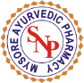

# S N Pandit Ayurvedic Company Pvt Ltd

[TOC]

* S.N. Pandit Health Care Division**

| | |
| --- | --- |
| Type | Private |
| Key people | Ranjani Karthik (Director) |
| Products | Herbal Cosmetics, Capsules, Herbal Supplements, Natural Food Supplements, Khadi Products, Aloevera Juice, Stamina Tonic, etc |
| Homepage | http://www.adpharma.in/ |
| Founder | Late Vaidya sri S.N.Pandit |
| Founded | 2006 |
| Location | Muktsar Road, Kot Kapura - 151204, Punjab, India |
| Standard Certifications | ISO 9001:2008 and GMP (Goods Manufacturing Practice from World Health Organization) |
| Status | Operational |

**S N Pandit Ayurvedic Company Pvt Ltd** is a manufacturer of Ayurvedic products based out of  Mysuru, Karnataka, India.

## Registered Address
* 25 & 26, Hootagalli Industrial Area, Automotive Axel Factory, Hootagalli, Mysuru, Karnataka 570018

## Manufacturing Locations
* 25 & 26, Hootagalli Industrial Area, Automotive Axel Factory, Hootagalli, Mysuru, Karnataka 570018

## Drugs with COPP (Certificate of Pharmaceutical products)
## List of Products
### Presently available in market
* Pinda Taila
* Maha kanaka Taila
* Dhanvantra Taila
* Bala Aswagandha Lakshadi
* Kesha Sanjeevini Taila
* Maha Bringamalaka Taila
* Drakshadi Paka
* Sarasaparilla Syrup (Sogadeberina sharabattu)
* Suvirechan
* Triphala Choorna
* Trikatu choorna
* Sitopaladi choorna

### List of proprietary products
* Shunti choorna
* Rasna Choorna
* Pippali choorna
* Nishamalaki Choorna
* Maha Talisadi choorna
* Maha Hingastaka choorna
* Avipattikara choorna
* Atimadhura choorna
* Aswagandhai choorna
* Aswagandha choorna
* Shatavari Rasayana
* Maha Sowbhagya Shunti

### Products that were available earlier
## Licenses Information
### Manufacturing licenses
## Trade marks registered
* S.N.Pandit & Sons

## References

## External Links
* [S N Pandit Ayurvedic Company Pvt Ltd on indiamart.com](https://www.indiamart.com/sn-pandit-sons/profile.html)
* [S N Pandit Ayurvedic Company Pvt Ltd on zaubacorp.com](https://www.zaubacorp.com/company/S-N-PANDIT-AYURVEDIC-COMPANY-PRIVATE-LIMITED/U24231KA1999PTC026167)

## References

1. [details"]("Product)(http://snpanditayurveda.com/ayurvedic-products)
