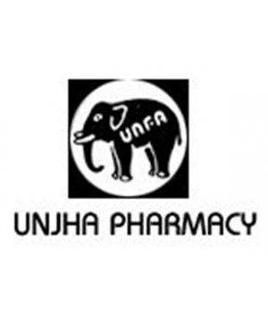

# Unjha Ayurvedic Pharmacy

[TOC]

* Unjha Ayurvedic Pharmacy**

| | |
| --- | --- |
| Type | Private |
| Key people | Mr. Dipen Shah (M.D.), Mr. Ramesh Goswami (Marketing Manager) |
| Products | All Kinds of Ayurvedic and Herbal Products |
| Homepage | http://www.unjhaayurvedicpharmacy.com/ |
| Founded | 1894 |
| Location | Dhanwantary Prasad, Station Road, Unjha - 384170, Gujarat, India |
| Standard Certifications | ISO 9001:2000. |
| Status | Operational |

**Unjha Ayurvedic Pharmacy** is a manufacturer of Ayurvedic products based out of  Unjha, Gujarat, India.

## Registered Address
* Dhanwantary Prasad, Station Road, Unjha - 384170, Gujarat, India

## Manufacturing Locations
* Dhanwantary Prasad, Station Road, Unjha - 384170, Gujarat, India

## Drugs with COPP (Certificate of Pharmaceutical products)
## List of Products
### Presently available in market
* Amiri Jivan
* Allerzun Tablet
* Balamrit
* Blossom Capsule
* Cruel Capsule
* Emivita Capsule

### List of proprietary products
* Amiri Jivan
* Livbond Drops
* Sundari Sanjivani Kalp
* Shankhpushpi
* Sarsaparila

### Products that were available earlier
## Licenses Information
### Manufacturing licenses
## Trade marks registered
## References

## External Links
* [Unjha Ayurvedic Pharmacy on tradeindia.com](https://www.tradeindia.com/Seller-238559-UNJHA-AYURVEDIC-PHARMACY/product-services.html)
* [S N Pandit Ayurvedic Company Pvt Ltd on zaubacorp.com](https://www.zaubacorp.com/company/S-N-PANDIT-AYURVEDIC-COMPANY-PRIVATE-LIMITED/U24231KA1999PTC026167)

## References

1. [Ayurvedic Pharmacy "Product details"](Unjha)
