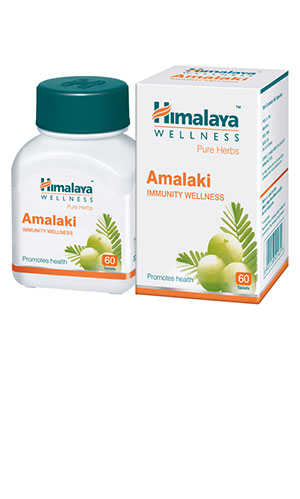

# Amalaki immunity wellness

[TOC]

## Herb functions:
1. Highly nutritious and the richest natural source of antioxidants.
1. Helps body build its natural defense system and supports its immune efforts to fight infections.
1. Active constituents have unique antioxidant effects that help rid the body of cell damaging free-radicals, rejuvenating the skin and preventing premature skin ageing.
1. Helps the body to cope with stress, and enhances general health and performance.

## Ideal For
* Low immunity
* Weakness

## Good to Know:
* 100% vegetarian.
* Free from sugar, artificial colors, artificial flavors, preservatives, and gelatin.

## Composition:
Each tablet contains: [Amalaki](Amalaki.md) (Emblica officinalis) fruit extract - 250 mg

## Dosage Recommendation:
1-2 tablets twice daily or as directed by your physician.
Special Instructions:

* Please inform your physician before consuming in the following situations
1. Pregnancy
1. Breastfeeding
1. Diabetes
1. Hypertension

* Specific contraindications have not been identified.
* Please consult your physician if symptoms persist.

## Note:-
This product is sold to you on the premise that you have received advice from a doctor and that you are not
self-medicating.
