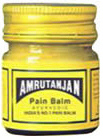

# Amrutanjan Balm

[TOC]

Ayurvedic Balm for Occasional Pain, Sprains, Headaches, Blocked nasal passages

Amrutanjan is a herbal ayurvedic formulation. A blend of aromatic herbs and essential oils, Amrutanjan Balm is well known for its ability to relieve occasional pain symptomatically.

It gives a very pleasant heating sensation when rubbed into the skin and gives instant relief. Great for occasional aches, pains, sprains and headaches. The balm is very strong and a little goes a long way

Amrutanjan balm is also very effective in clearing up nasal passages instantly and gives immediate relief when applied on the nose and forehead. Amrutanjan balm is also used to take steam vapors.

## Application of Amrutanjan Balm
Rub on the sore spot for relief from pain, aches and sprains. For clearing nasal passages apply on the nose and forehead. The balm is very strong and only a small amount should be applied. Steam vapors can also be taken. Drop a dollop of the balm in hot steaming water. Then inhale the vapors. Place a towel over your head to cover your face and head while taking in the steam and for a little while afterwards. For external use only.

## Amrutanjan Balm Main Ingredients
1. EUCALYPTUS OIL
1. CAMPHOR
1. WINTERGREEN OIL
1. MENTHOL
1. LEMON GRASS OIL
1. [Peppermint](Peppermint.md) OIL
1. CINNAMON LEAF OIL
1. THYMOL
1. [Rose](Rose.md) OIL
