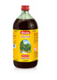

# Angoorasava

[TOC]

## Importance
Ayurved Sar Sangrah/Sarvang Durbalata Chikitsadhikar Baidyanath Angoorasav is very useful medicine for general debility and loss of appetite. It is prepared by the use of fresh [grape](grape.md)s and beneficial ayurvedic herbs. It provides strength and stamina to the body. It improves the secretion of digestive enzyme from the gastrointestinal tract.

## Dosage
15-30ml after meal with equal quantity of water or as directed by the physician.

## Indications
It is a useful stimulant for loss of appetite and general debility.

## References
* [Baidyanath](http://www.baidyanath.org/ViewProduct/angoorasava)
