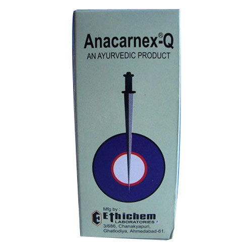

# Anti Cancer Medicines

[TOC]

Widely consumed for the treatment of varied types of malignancy.

## Advantages
* **Anacarnex**: Attacks only the cancer cells without doing any harm to the other body tissues.
* It does not adversely affect the blood picture or [Blood pressure](../concepts/Blood_pressure.md) even when the treatment is prologned and repeated pathological check-ups of blood are not required-a facility available only in large cities. The treatment can be carried out even in villages.
* Anacamex Shows clinical improvement within a short period of 4 weeks and gives feeling of general well being to the patient. The treatment may be continued even after the patient feels relieved of the symptoms with a maintenance dose to prevent recurrence.

## External Links
* [Ethichem Laboratories](http://www.indiamart.com/ethichemlaboratories/cancer.html)
