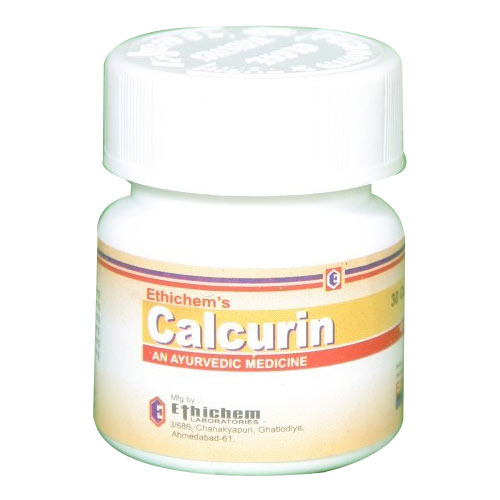

# Anti Stone Formation Medicines

[TOC]

**Calcurin Capsule** is indicated for :

* Clears urinary infections
* Well tolerated, no toxic or side effects
* Safe during pregnancy
* Disintegrates and expels calculi, reduces the excretion of urinary oxalates and checks the growth or recurrence of stones
* Reduces the risk of stone formation
* Averts surgical procedures
* Dissolves and expels calculi
* Urinary stones and crystaluria

## Composition:
* Pattarfori 100 mg
* Gokharu - Padalium Murex 125 mg
* Yovksar - Hordeumvulgare 25 mg
* Navsar - bhasma Ammoni Chioridum 25 mg
* Akkalkaro - Anacycluspyrathrum 25 mg
* [Punarnava](Punarnava.md) - Boerhaviadiffusa 125 mg

## External Links
* [Ethichem Laboratories](http://www.indiamart.com/ethichemlaboratories/stone-formation.html)
