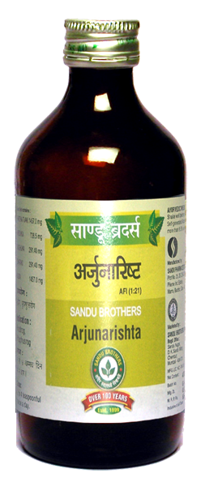

# Arjunaarishta

[TOC]

**Arjunaarishta** is used to treat Heart related problems and Breathing problems. It is a blood purifier tonic as well.

Researchers have reported patients with Ischemic heart diseases benefited with bark extract from [Terminalia arjuna](Terminalia_arjuna.md) has similar favorable antioxidant effect as vitamin E when given in doses of 500 mg/day.

Researchers found that the plant with its arjunic and terminic acids, glycosides and antioxidants, decreased the frequency of angina when given in doses of 500mg every 8 hrs. for 1 week. The dose also decreased the need per isosorbide dinitrate, an antianginal prescription medication. Arjunolic acid, an Arjuna triterpene and a potent part of the Arjuna bark, may also offer cardiac protection

## Indications
Cardiac Disease

## Dose
4 tsf 2 times with equal quantity of water

## Ingredients
[Terminalia arjuna](Terminalia_arjuna.md), [Vitis vinifera](Vitis_vinifera.md),  [Woodfordia fruticosa](Woodfordia_fruticosa.md), Jaggery etc.

## References

## References

1. ”Karnataka Medicinal Plants Volume - 2” by Dr.M. R. Gurudeva, Page No.73, Published by Divyachandra Prakashana, #45, Paapannana Tota, 1st Main road, Basaveshwara Nagara, Bengaluru.
