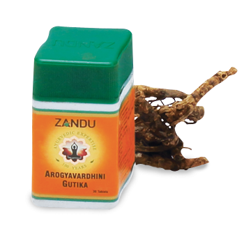

# Arogyavardhani Gutika

[TOC]

Curative for 'Pittavikar' like skin diseases and blood disorders such as Jaundice, Aneamia. Helpful in Loss of appetite. Abhraka, maksika, svarna, rajata, tamra, kamsya etc are used in bhasma form . Drugs such as gandhaka, manahsila etc are used in purified form.

## Composition
Abhrak bhasma, Gandhak, Loha bhasma, Parad Tamra bhasma (1 part each), Shuddha Shilajit (15 parts), Chitrak mool, [Mahisaksa](Mahisaksa.md) (Shuddha Guggul) (20 parts each), [Triphala](Triphala.md) (30 parts), Katuki (90 parts).

## Dosage
1 to 3 tablets three times with milk or water. In dropsy, to be taken with only milk diet.

* Useful in Jaundice, Hepatitis, Congestion of the Liver, Anaemia, Enlargement of the Spleen, Dysepsia and Dropsy. More suitable to those suffering from dropsy and are less Anaemic but more constipative. Pitta vikar like skin diseases and blood disorders like jaundice, anaemia and useful in poor appetite.
