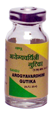

# Arogyavardhini

[TOC]

It has laxative action which helps to eliminate toxins out of the body, therefore it is recommended in chronic constipation and skin disorders. It possess Cholagogue, hepatoprotective and liver stimulant action and is indicated in Jaundice, Hepatitis and chronic indigestion. It is useful in cases of generalised oedema and ascites as it has laxative and diuretic action which helps to excrete excess fluid out of body.
Arogyavardhini by its cholagogue action stimulates secretion of Bile from Liver into small intestine which in turn binds to fat present in food; excrete them out without being absorbed. Therefore it is useful in Hyperlipidaemia and Obesity. In endocrine disorder it is also used for long term treatment. It regulates secretion of digestive enzymes in G.I. tract therefore indicated in cases of chronic indigestion.

## Indications
1. Jaundice
1. Hepatitis
1. Generalised oedema
1. Ascites
1. Skin disorders
1. Chronic Constipation
1. Hyperlipidaemia
1. Chronic indigestion
1. Anaemia.

## Dose
1-2 tablet 2-3 times

## Ingredients
1. Purified Mercury
1. Purified Sulphur
1. Lohabhasma
1. bhrakbhasma
1. Tamrabhasma
1. Embelica officinalis
1. [Haritaki](Haritaki.md) (Terminalia chebula)
1. Terminalia bellerica
1. Purified shilajeet
1. Purified Commifora mukul
1. Plumbago zeylanica
1. Picrirrhiza kurroa
1. Azadirachta indica
