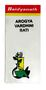

# Arogyavardhini bati

[TOC]

## Importance
Arogyavardhini Bati is useful in Jaundice, Anaemia, Dyspepsia, Leprosy, Fever, [Obesity](../medicines/Obesity.md) and other Hepatic disorders

## Dosage
2 tablet twice in a day, before or after food or as directed by physician.

## Indications
* Jaundice
* Anaemia
* Dyspepsia

## References
* [Baidyanath](http://www.baidyanath.org/ViewProduct/arogyavardhini-bati)
